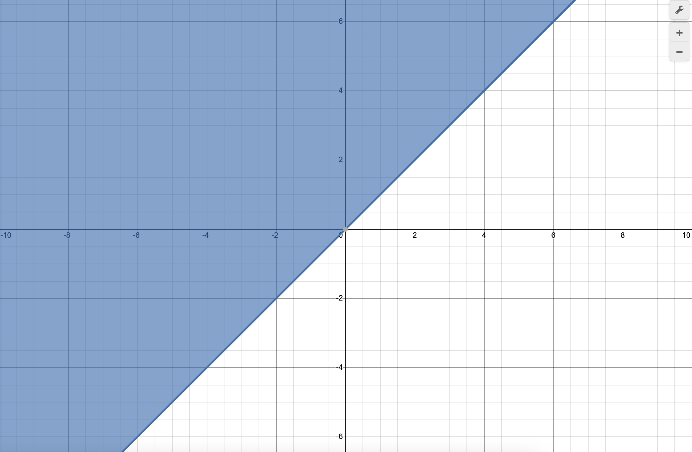
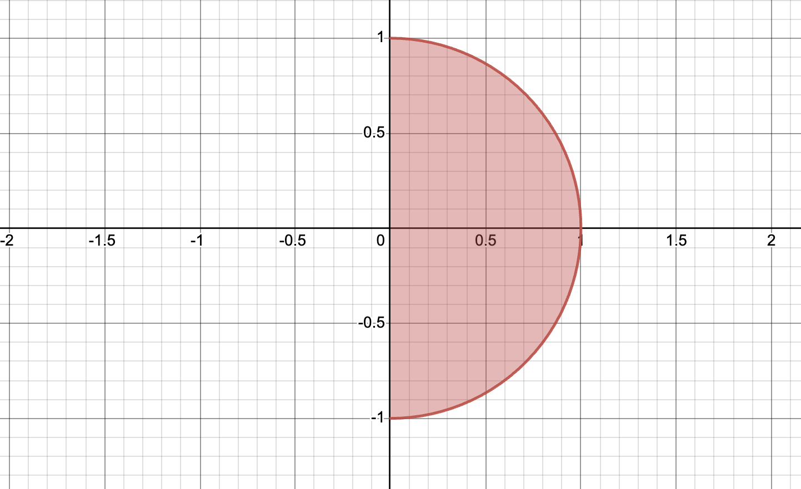
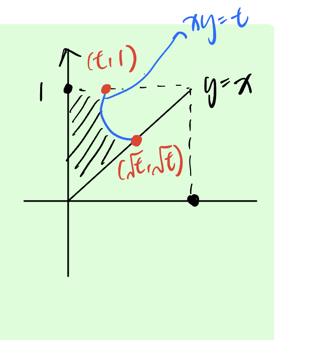
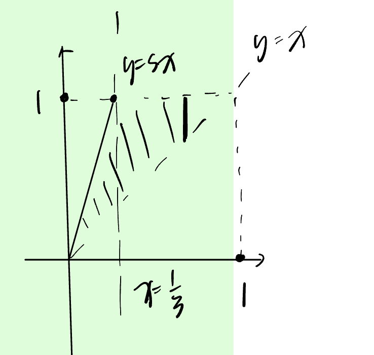

## Table of Contents
2. [Univariate Random Variables](#2-univariate-random-variables)

    2.1 [Introduction to probability model](#21-introduction-to-probability-model)
    2.2 [Discrete random variable](#22-discrete-random-variable)
    2.3 [Continuous random variable](#23-continuous-random-variable)
    2.4 [Expectation](#24-expectation)
    2.5 [Moment generating function](#25-moment-generating-function) 

3. [Joint Distribution](#3-joint-distribution)

## 2 Univariate Random Variables
### 2.1 Introduction to probability model
- <b>Probability model</b> is used to describe a random exprienment.
It consists of three important components:
    1. <b>Sample space</b> $S$: a collection of all possible outcomes of one random experiment.
        >e.g. Toss a coin: $S = \{H, T\}$

        >e.g. Toss a coin twice: $S = \{(H,H), (H,T), (T,H), (T,T)\}$
    2. <b>Event</b>: denoted by $A, B, C$, etc. It is a subset pf sample space.
        >e.g. Toss a coin twice:
        Define A as 1st toss is tail, $A = \{(T,T), (T,H)\} \subseteq S$
    3. <b>Probability function</b> $P$: It is a function of events. 
    It satisfies properties (axioms):
        1. $0 \leq P(A) \leq 1$ for any event $A$.
        2. $P(S) = 1$
        3. Countable additivity: If $A_1, A_2, \dots$ are assumed to be pairwise multually exclusive events (i.e. $A_i \cap A_j = \emptyset$ for $i \neq j$), $\displaystyle P\left(\bigcup_{i=1}^{\infty} A_i\right) = \sum_{i=1}^{\infty} P(A_i)$.

        We can now prove the following properties:
        1. $P(\emptyset) = 0$.
            >Proof: Let $A_i = \emptyset$ for $i \geq 1$, $A_i \cap A_j = \emptyset$ for $i \neq j$, by axioms we have $\displaystyle P\left(\bigcup_{i=1}^{\infty} A_i\right) = \sum_{i=1}^{\infty} P(A_i)$, or in other words, $\displaystyle P(\emptyset)=\sum_{i=1}^{\infty}P(\emptyset)$. Additionally, $0 \leq P(\emptyset) \leq 1$, therefore, $P(\emptyset) = 0$.
        2. Let A denote an event. Let $\bar{A}$ denote the complementary event of A, which means $\bar{A}$ saitifies two conditions:
            1) $\bar{A} \cap A = \emptyset$, and
            2) $\bar{A} \cup A = S$.

            Prove $P(A) + P(\bar{A}) = 1$:
            >Proof: Define $A_1 = A$, $A_2 = \bar{A}$, $A_i = \emptyset$ for $i \geq 3$, so $A_i \cap A_j = \emptyset$ for $i \neq j$, by axioms we have $\displaystyle P\left(\bigcup_{i=1}^{\infty} A_i\right) = \sum_{i=1}^{\infty} P(A_i)$, in other words, $\displaystyle P(S) = P(A) + P(\bar{A}) + \sum_{i=3}^{\infty}0$, therefore, $P(A) + P(\bar{A}) = 1$.
        3. If $A_1$ and $A_2$ are mutually exclusive, then $P(A_1 \cup A_2) = P(A_1) + P(A_2)$.
            >Proof: Define $A_i = \emptyset$ for $i \geq 3$, so $S = A_i \cap A_j = \emptyset$, for $i \neq j$. Then $\displaystyle P\left(\bigcup_{i=1}^{\infty} A_i\right) = \sum_{i=1}^{\infty} P(A_i)$, or in other words, $P(A_1 \cup A_2) = P(A_1) + P(A_2) + 0$.
        4. In general, $P(A_1 \cup A_2) = P(A_1) + P(A_2) - P(A_1 \cap A_2)$.
            >
            Proof: Define $B=\{\omega|\omega \in A_1, \omega \notin A_2\}$, since $A_1 = B\cup (A_1\cap A_2)$, we can get $B\cap (A_1 \cap A_2) = \emptyset$, $B\cup (A_1 \cap A_2) = A_1$, $B\cap (A_1 \cap A_2) = \emptyset$, $B\cap A_2 = \emptyset$, and therefore  $B\cup A_2 = A_1 \cup A_2$.
            Then $P(A_1 \cup A_2) = P(B \cup A_2) = P(B) + P(A_2)$. Note $P(A_1 \cup A_2) = P(A_2) + P(B)$ and $P(B) = P(A_1) - P(A_1 \cap A_2)$. Hence, $P(A_1 \cup A_2) = P(A_1) + P(A_2) - P(A_1 \cap A_2)$.
        5. If $A_1 \subseteq A_2$, then $P(A_1) \leq P(A_2)$
            >
            Proof: $A_2 \setminus A_1 := B  = \{\omega | \omega \in A_2, \omega \notin A_1\}$, we have $B\cap A_1 = \emptyset$, $B \cup A_1 = A_2$. Then $P(A_2) = P(A_1 \cup B) = P(A_1) + P(B) \geq P(A_1)$.
        
        
        >e.g. Toss a coin twice
        Then $S = \{(H,H), (H,T), (T,H), (T,T)\}$ for any event A,
        $$P(A):= \frac{\text{\# of elements in }A}{4}$$
        Verify P is a probability function.

- <b>Conditional probability</b>
    Suppose $A$ and $B$ denote two events. Provided $P(B) > 0$, then the conditional probability of A given B is
    $$P(A|B) = \frac{P(A \cap B)}{P(B)}$$
    - <b>Independence of two events</b>
        Suppose A and B denotes two events. We say A and B are independent if and only if
        $$P(A \cap B) = P(A)P(B)$$
        - Proposition: If A and B are independent, then $P(A|B) = P(A)$ (We assume $P(B) > 0$)
            >Proof: $P(A|B) = \frac{P(A \cap B)}{P(B)} = \frac{P(A)P(B)}{P(B)} = P(A)$
        >e.g. Toss a coin twice
            $A:= 1\text{st toss is a head} = \{(H,T), (H,H)\}\\B:= 2\text{nd toss is a head} = \{(T,H), (H,H)\}$
            For any event $C$, $P(C) = \frac{\text{\# of elements in }C}{4}$
            Verify A and B are independent.
            $P(A \cap B) = P(A)P(B)$?
            By definition, $A\cap B = \{(H,H)\} \implies P(A \cap B) = \frac{1}{4}$
            $P(A) = \frac{2}{4}$, $P(B) = \frac{2}{4}$.
            Hence, $P(A \cap B) = P(A)P(B)$.
- <b>Random variable (r.v.)</b> $X,Y, \zeta, \eta$
Random variable is a function from sample space to real line.
$$X: S \to \mathbb{R}$$
Specifically, given any $\omega \in S$, $X(\omega) \in \mathbb{R}$.
This function satisfies that for any $x\in \mathbb{R}$, $\{X\leq x\}=\{\omega|X(\omega) \leq x\}$ is an event.
    >e.g. Toss a coin twice
    $X:\text{\# of heads in two tosses}$.
    $X: (H,H) \mapsto 2$.
    We need to check for any $x$, $\{X\leq x\}$ is an event.
        1. $x \geq 2$, $\{X\leq x\}=\{\omega|X(\omega) \leq x\} = S$
        2. $x \in [1,2)$, what is $\{X\leq x\}$?
        3. $x \in [0,1)$, what is $\{X\leq x\}$?
        4. $x < 0$, what is $\{X\leq x\}$?

- <b>Cumulative distribution of X (c.d.f.)</b>
    For any $x \in \mathbb{R}$, the c.d.f. of $X$ is defined as $F(x) = P(X \leq x)$.
    It satisfies the following property:
    1. $F(x)$ is a non-decreasing fucntion, i.e., if $x_1 \leq x_2$, then $F(x_1) \leq F(x_2)$.
        >Proof: $\{X \leq x_1\}$ is an event. $\{X \leq x_1\} \subseteq \{X \leq x_2\}$ if $x_1 < x_2$, since $\{\omega|X(\omega) \leq x_1\} \leq \{\omega|X(\omega) \leq x_2\}$.
    2. $\displaystyle \lim_{x \to -\infty} F(x) = 0$, $\displaystyle \lim_{x \to \infty} F(x) = 1$.
    3. $F(x)$ is a right-continuous function, i.e., for any $a\in \mathbb{R}$, $\displaystyle \lim_{x \to a^+} F(x) = F(a)$. 
     

    1, 2 and 3 are three basic properties of a c.d.f.
    Some extra properties of a c.d.f.:

    4. $P(a < X \leq b) = F(b) - F(a)$.
        >Proof: Define $A=\{X\leq b\}, B:=\{X\leq a\}, C=\{a<x\leq b\}$, we want to prove: $P(a<X\leq b) = P(X\leq b) = P(X\leq a) \iff P(C)=P(A)-P(B)$. Note $B\cap C = \emptyset$, $B\cup C = A$. Then $P(A) = P(B\cup C) = P(B) + P(C)$.
    5. $P(X = a) = P(X\leq a) - P(x<a)=F(a)-F(a^-)$.
        > Proof: $P(X=a) = P(X\leq a) - P(X<a) = F(a) - \displaystyle \lim_{x \to a^-} F(x) = \lim_{x \to a^+}F(x)- \lim_{x \to a^-}F(x)$.
        

### 2.2 Discrete random variable
>Definition:
> If a random variable $X$ can only take on a finite or countably infinite number of values, then $X$ is called a discrete random variable.
- <b>cdf</b> of a discrete r.v. is a right continuous step funciton
    
- <b>Probability function (pf):</b> $f(x) = P(X=x)$.
    For a discrete r.v., $f(x)\begin{cases}>0&\text{if }X\text{ can take value }x\\=0&\text{if } X \text{ cannot take value } x\end{cases}$
- <b>Support</b>: The set $A = \{x: f(x) > 0\}$ is called the support of $X$. These are all the possible values that $X$ can take.
- Properties of a p.f. $f$ for a discrete r.v. $X$.
    1. $f(x) \geq 0$ for any $x \in \mathbb{R}$.
    2. $\displaystyle \sum_{x\in A} f(x) = 1$.
        > Proof: The support of X is a countable set, $A = \{x_1, \dots, x_n\}$. Let $B_i=\{X=x_i\}$ is an event for $i=1,...,n$. $B_i$ are pairwise mutually exclusive events, i.e. $B_i \cap B_j = \emptyset$ for $i \neq j$. Then, $\displaystyle \bigcup_{i=1}^n B_i = S$. Then, $\displaystyle1=P(S)=P\left( \bigcup_{i=1}^n B_i\right)=\sum_{i=1}^n P(B_i) = \sum_{i=1}^n P(X=x_i)$.
- Some commonly used discrete r.v.
    1. Bernoulli r.v. $X \sim \text{Bern}(p)$.
        X can only take two possible values, 0 and 1. $A = \{0,1\}$.
        $f(1) = P(X=1) = p$.
    2. Binomial distribution
        Toss a coin $n$ times.
        a. different tosses are indepedent
        b. probability of getting a head is fixed, which is denoted by $p$.
        $X$: # of heads across $n$ tosses, then $X \sim \text{Bin}(n,p)$.
        Hence the support of $X$, $A = \{0,1,2,\dots, n\}$.
        The p.f. of $X$ is $f(x) = P(X=x) = \displaystyle \binom{n}{x}p^x(1-p)^{n-x}$, $x\in A$.
        $\displaystyle \sum_{x=0}^{n} \binom{n}{x}p^x(1-p)^{n-x}=[p+(1-p)]^n=1$
    3. Geometric distribution
        $X$: # of failures before the first success.
        The support of $X$ is $A=\{0,1,...\}$.
        $f(x) = P(X=x) = (1-p)^xp$, $x\in A$.
        $\displaystyle \sum_{x=0}^{\infty} (1-p)^xp = \frac{p}{1-(1-p)} = 1$
    4. Negative binomial r.v. $X \sim \text{NegBin}(r, p)$
        $X$: # of failures before the $r$th success.
    5. Poisson r.v. $X \sim \text{Poisson}(\mu)$
        The support of $X$, $A = \{0,1,\dots\}$.
        The probability function $f(x) = P(X=x) = \frac{\mu^x}{x!}e^{-\mu}$, $x\in A$.
        $\displaystyle \sum_{x\in A} f(x) = \sum_{x=0}^{\infty} \frac{\mu^x}{x!}e^{-\mu} = e^{-\mu}\sum_{x=0}^{\infty} \frac{\mu^x}{x!} = e^{-\mu}e^{\mu} = 1$.
        Aside: $\displaystyle e^x = \sum_{k=0}^{\infty} \frac{x^k}{k!}$.

### 2.3 Continuous random variable
> Definition: If the collection of all possible values $X$ can take is an interval or the real line, then X is called a continuous r.v.
>
> - Remark: If $X$ is continuous r.v., its cdf $F(x)$ is continuous everywhere. Moreover, $F$ is differentialbe almost everywhere. It is not differentiable at atmost countable locations.

- Probability density function (pdf): $$f(x) = \begin{cases}F'(x)&\text{ if F is differentiable at }x\\0&\text{ otherwise}\end{cases}$$

- Support of X: $A = \{x| f(x) > 0\}$.
- Basic property of f:
    1. $f(x) \geq 0$ for any $x \in \mathbb{R}$.
    2. $\displaystyle \int_{-\infty}^{\infty} f(x)dx = 1$.
- Extra properties of f:
    1. $F(x)=\int_{-\infty}^xf(t)dt=F(x)-F(-\infty)$ (find cdf from pdf).
    2. $f(x)=\begin{cases}F'(x)&\text{ if F is differentiable at }x\\0&\text{ otherwise}\end{cases}$ (find pdf from cdf).
    3. $P(X=x)=0$ and $f(x) \neq P(X=x)$ for any $x$.
    If $F$ is differentiable at $x$, then $f(x) = \displaystyle \lim_{h \to 0} \frac{F(x+h)-F(x)}{h}\\\implies F(x+h)-F(x) \approx f(x)\cdot h\\\implies P(x<X\leq x+h)\approx f(x)\cdot h$.
    4. $P(a<X\leq b)=F(b)-F(a)=P(a<X<b)=P(a\leq X\leq b)$
    >Example (Uniform distribution):
    Suppose the cds if 
    $$F(x) = \begin{cases}0&x\leq a\\\frac{x-a}{b-a}&a< x < b\\1&x\geq b\end{cases}$$
    Find pdf $f(x)$:
    The pdf is: $f(x)\begin{cases}0& x\leq a\\\frac{1}{b-a}&a<x<b\\0&x\geq b\end{cases}$

    >Example:
    Define a function $$f(x)=\begin{cases}\frac{\theta}{x^{\theta+1}}&x\geq 1\\0&\text{otherwise}\end{cases}$$.
    >1. Find for what values of $\theta$, f is a pdf?
    >> Solution:$f(x) \geq 0$ for any $x \in \mathbb{R}$, therefore $\theta \geq 0$.$\int_{-\infty}^{\infty} f(x)dx = \int_{1}^{\infty} \frac{\theta}{x^{\theta+1}}dx$.
    >>>Case 1: $\theta = 0$, $\int_{-\infty}^{\infty} f(x)dx = 0 \neq 1$.
    >>
    >>>Case 2: $\theta > 0$, $\int_{-\infty}^{\infty} f(x)dx = \int_{1}^{\infty} \frac{\theta}{x^{\theta+1}}dx = \left. -\frac{1}{x^{\theta}}\right|_1^{\infty} = 1$.
    >
    >2. Find $F(x)$ if $f$ is a pdf.
    >> Solution: $F(x) = \int_{-\infty}^x f(t)dt$
    >>> Case 1: $x \leq 1$, $F(x) = \int_{-\infty}^x f(t)dt = 0$.
    >>
    >>> Case 2: $x>1$, $F(x) = \int_{-\infty}^x f(t)dt = \int_{1}^x \frac{\theta}{t^{\theta+1}}dt = \left. -\frac{1}{t^{\theta}}\right|_1^x = 1 - \frac{1}{x^{\theta}}$.
    > 3. Find $P(2<X<3)$ and $P(-2<X<3)$.
    >>Solution: 
    >>$P(2<X<3) = F(3) - F(2) = \left(1-\frac{1}{3^{\theta}}\right) - \left(1-\frac{1}{2^{\theta}}\right) = \frac{1}{2^{\theta}} - \frac{1}{3^{\theta}}$.
    >>$P(-2<X<3) = F(3) - F(-2) = \left(1-\frac{1}{3^{\theta}}\right) - 0 = 1-\frac{1}{3^{\theta}}$.
    >>$P(-2<X<3) = \int_{-2}^3 f(x)dx = \int_{-2}^1 f(x)dx + \int_1^3 f(x)dx = \int_{-2}^1 0dx + \int_{1}^3 \frac{\theta}{x^{\theta+1}}dx = \left. -\frac{1}{x^{\theta}}\right|_1^3 = 1-\frac{1}{3^{\theta}}$.

    - Gamma function, $\Gamma (\alpha), \alpha > 0$.
    $$\Gamma(\alpha) = \int_0^{\infty} x^{\alpha-1}e^{-x}dx$$
        1. $\Gamma(\alpha) = (\alpha-1) \Gamma(\alpha-1)$.
        2. $\Gamma(n) = (n-1)!$ when $n$ is a positive integer, $\Gamma(1) = 1$.
        3. $\Gamma(\frac{1}{2}) = \sqrt{\pi}$.
        
        >Example (Gamma distribution):
        The pdf is $$f(x) = \begin{cases}\frac{x^{\alpha-1}e^{-x/\beta}}{\beta^\alpha\Gamma(\alpha)}&x>0\\0&\text{otherwise}\end{cases}$$
        if $\alpha>0, \beta > 0$ are constants.
        Verify $f$ is a pdf.
        >>Solution:
            >>1. $f(x) \geq 0$ for any $x \in \mathbb{R}$.
            >>2. $\displaystyle \int_{-\infty}^{\infty} f(x)dx = \int_{-\infty}^0f(x)dx+\int_0^{\infty}f(x)dx = 0 + \int_0^{\infty} \frac{x^{\alpha-1}e^{-x/\beta}}{\beta^\alpha\Gamma(\alpha)}dx$.
            Here, note $\displaystyle \int_0^{\infty} x^{\alpha-1}e^{-x}dx = \Gamma(\alpha)$.
            Let $y=\frac{x}{\beta}\implies x=\beta y$, $dx = \beta dy$.
            Then, $\displaystyle \int_0^{\infty} \frac{x^{\alpha-1}e^{-x/\beta}}{\beta^\alpha\Gamma(\alpha)}dx = \int_0^{\infty} \frac{(\beta y)^{\alpha-1}e^{-y}}{\beta^\alpha\Gamma(\alpha)}\beta dy = \frac{1}{\Gamma(\alpha)}\int_0^{\infty} y^{\alpha-1}e^{-y}dy = \frac{1}{\Gamma(\alpha)}\Gamma(\alpha) = 1$.

        >Example (Weibull distribution):
        The pdf is $$f(x) = \begin{cases}\frac{\beta}{\theta^{\beta}}x^{\beta-1}\text{exp} \left\{ -\left(\frac{x}{\theta}\right)^{\beta}\right\} &x>0\\0&x<0 \end{cases}$$
        where $\alpha > 0, \beta > 0$ are constants, $X \sim \text{Weibull}(\theta, \beta)$.
        Verify $f$ is a pdf.
        >>Solution:
            >>1. $f(x) \geq 0$ for any $x \in \mathbb{R}$.
            >>2. $\displaystyle \int_{-\infty}^{\infty} f(x)dx = \int_{-\infty}^0f(x)dx+\int_0^{\infty}f(x)dx = 0 + \int_0^{\infty} \frac{\beta}{\theta^{\beta}}x^{\beta-1}\text{exp} \left\{ -\left(\frac{x}{\theta}\right)^{\beta}\right\}dx$.
            Let $y=（\frac{x}{\theta}^\beta \implies x = \theta y^{\frac{1}{\beta}}$, $dx = \theta \frac{1}{\beta}y^{\frac{1}{\beta}-1}dy$.
            Then, $\displaystyle \int_{-\infty}^{\infty} f(x)dx = \int_0^{\infty} \frac{\beta}{\theta^{\beta}}(\theta y^{\frac{1}{\beta}})^{\beta-1}\text{exp} \left\{ -y\right\}\theta \frac{1}{\beta}y^{\frac{1}{\beta}-1}dy = \Gamma(1) = 1$.
        
        >Exmaple (Normal distribution/Gaussian distribution):
        The pdf is $$f(x) = \frac{1}{\sqrt{2\pi}\sigma}e^{-\frac{(x-\mu)^2}{2\sigma^2}}$$ for $x\in \mathbb{R}$,
        where $\mu \in \mathbb{R}$, $\sigma > 0$ are constants, $X \sim \text{Normal}(\mu, \sigma)$.
        Verify $f$ is a pdf.
        >> Solution:
            >> 1. $f(x) \geq 0$ for any $x \in \mathbb{R}$.
            >> 2. $\displaystyle \int_{-\infty}^{\infty} f(x)dx = 1$.
            To verify 2, we start from a special case, where $\mu = 0$, $\sigma = 1$.
            $f(x) = \frac{1}{\sqrt{2\pi}}e^{-\frac{x^2}{2}}$, i.e., $\int_{-\infty}^{\infty}f(x)dx=\int_{-\infty}^{\infty} \frac{1}{\sqrt{2\pi}}e^{-\frac{x^2}{2}}dx = 1$.
            $\int_{-\infty}^{\infty} \frac{1}{\sqrt{2\pi}}e^{-\frac{x^2}{2}}dx = 2\int_0^\infty \frac{1}{\sqrt{2\pi}}e^{-\frac{x^2}{2}}dx$. Let $y = \frac{x^2}{2} \implies x=\sqrt{2y}$, $dx = \sqrt{2}dy$.
            Then, $2\int_0^\infty \frac{1}{\sqrt{2\pi}}e^{-\frac{x^2}{2} }dx = \frac{1}{\sqrt{\pi}}\int_0^\infty e^{-y} y^{1-1/2}dy = \frac{1}{\sqrt{\pi}}\Gamma(1/2) = 1$.
            >>
        >>Prove $f(x) = \frac{1}{\sqrt{2\pi}\sigma}e^{-\frac{(x-\mu)^2}{2\sigma^2}}$ is a pdf for any $\mu \in \mathbb{R}$, $\sigma > 0$.
        >>1. $f(x) \geq 0$ for any $x \in \mathbb{R}$.
        >>2. $\int_{-\infty}^{\infty} f(x)dx = 1$?
            $\int_{-\infty}^{\infty} f(x)dx =\int_{-\infty}^{\infty} \frac{1}{\sqrt{2\pi}\sigma}e^{-\frac{(x-\mu)^2}{2\sigma^2}} dx$.
            Let $z=\frac{x-\mu}{\sigma}\implies x=\mu+\sigma z, dx=\sigma dz$
            $\int_{-\infty}^{\infty} \frac{1}{\sqrt{2\pi}\sigma}e^{-\frac{z^2}{2}} dz=\int_{-\infty}^{\infty} \frac{1}{\sqrt{2\pi}\sigma}e^{-\frac{x^2}{2}} dx=1$.

### 2.4 Expectation
- Definition of expectation for discrete r.v.
    Suppose that $X$ is a discrete r.v. with support $A$ and p.f. $f(x)$.
    Then, $E(X)=\sum_{x\in A} xf(x)$ provided $\sum_{x\in A} |x|f(x) < \infty$.
- Definition of expectation for continuous r.v.
    Suppose that $X$ is a continuous r.v. with support $A$ and pdf $f(x)$.
    Then $E(X)=\int_{-\infty}^{\infty}xf(x)dx$ provided $\int_{-\infty}^{\infty}|x|f(x)dx < \infty$.
    >Example (Cauchy distribution):
    The pdf of $X$ is $f(x) = \frac{1}{\pi(1+x^2)}$ for $x\in \mathbb{R}$.
    Find $E(X)$.
    >>Solution:
    >>$\int_{-\infty}^{\infty} |x|f(x)dx = \int_{-\infty}^{\infty} |x|\frac{1}{\pi(1+x^2)}dx = 2 \int_0^{\infty} \frac{x}{\pi(1+x^2)}dx=\left.\frac{\ln (1+x^2)}{\pi}\right|_0^\infty=\infty$.
    Therefore, $E(X)$ does not exist.

    >Example:
    Suppose p.f. $f(x)=\frac{1}{x(x+1)}$ for $x=1,2,3,\dots$, the support of $X$ is $A=\{1,2,3,\dots\}$.
    >1. Show $f$ is a p.f.
    >>Solution:
    >>1. $f(x) \geq 0$ for any $x \in \mathbb{R}$.
    >>2. $\sum_{x\in A}f(x)=\sum_{x\in A}\frac{1}{x(1+x)}=\sum_{x=1}^{\infty}\left(\frac{1}{x}-\frac{1}{x+1}\right)=1-\frac{1}{2}+\frac{1}{2}-\frac{1}{3}+\frac{1}{3}-\frac{1}{4}+\dots=1$.
    >2. Find $E(X)$.
    >>Solution: $E(X)=\sum_{x\in A}xf(x)=\sum_{x\in A}x\frac{1}{x(x+1)}=\sum_{x\in A}\frac{1}{x+1}=\sum_{x=1}^{\infty}\frac{1}{x+1}=\infty$.
    $E(X)$ does not exist.

    >More examples of expectations:
    >1. Binomial Distribution, $X \sim \text{Bin}(n,p)$.
        >> Solution 1: $E(X)=\sum_{x\in A}xf(x)=\sum_{x=0}^nx\frac{n!}{x!(n-x)!}p^x(1-p)^{n-x}=\sum_{x=1}^nx\frac{n!}{x!(n-x)!}p^x(1-p)^{n-x}=\sum_{x=1}^n\frac{n!}{(x-1)!(n-x)!}p^x(1-p)^{n-x}$. 
        Let $y=x-1$, then $\sum_{x=1}^n\frac{n!}{(x-1)!(n-x)!}p^x(1-p)^{n-x}=np\sum_{y=0}^{n-1}\frac{(n-1)!}{y!(n-1-y)!}p^y(1-p)^{n-1-y}=np$, since $\sum_{y=0}^{n-1}\frac{(n-1)!}{y!(n-1-y)!}p^y(1-p)^{n-1-y}$ is a pf of $\text{Bin}(n-1,p)$.
        >
        >> Solution 2: For the $i$th trial, $X_i=\begin{cases}1&\text{if the }i\text{th outcome is a success}\\0&\text{otherwise}\end{cases}$.
        Then, $P(X_i=1)=p$. Let $X=\sum_{i=1}^n X_i$, then $X \sim \text{Bin}(n,p)$.
        $E(X)=E(\sum_{i=1}^n X_i)=\sum_{i=1}^n E(X_i)=\sum_{i=1}^n 1\cdot P(X_i=1)=np$.
    > 2. Suppose $X$ is a continuous r.v. with pdf $f(x)=\begin{cases}\frac{\theta}{x^{\theta +1}}&x\geq 1\\0&\text{otherwise}\end{cases}$, where $\theta > 0$ is a constant. Find $E(X)$, and determine the values of $\theta$ for which $E(X)$ exists.
        >> Solution: $\int_{-\infty}^{\infty} |x|f(x)dx=\int_{1}^{\infty} x\frac{\theta}{x^{\theta +1}}dx=\int_{1}^{\infty} \frac{\theta}{x^{\theta}}dx<\infty$ iff $\theta > 1$.
        When $\theta>1$, $E(X)=\int_{-\infty}^{\infty} xf(x)dx=\int_{1}^{\infty} \frac{\theta x}{x^{\theta +1}}dx=\theta\int_{1}^{\infty} \frac{1}{x^{\theta}}dx=\left. \left(\frac{\theta}{1-\theta}x^{1-\theta}\right)\right|_1^{\infty}=\frac{\theta}{\theta-1}$.
        When $\theta \leq 1$, $E(X)$ does not exist.
- Expectation of a function of X
    Suppose thar $X$ is a r.v., what is $E(g(X))$, where $g$ is a real function?
    For example, $g(x)=x^2$.
    Let $Y=g(X)$, find $E(Y)$.
    - Case 1: If $X$ is a discrete r.v. with support $A$ and p.f. $f(x)$, then $E(g(X))=\sum_{x\in A}g(x)f(x)$ provided $\sum_{x\in A}|g(x)|f(x)<\infty$.
    - Case 2: If $X$ is a continuous r.v. with support $A$ and pdf $f(x)$, then $E(g(X))=\int_{-\infty}^{\infty}g(x)f(x)dx$ provided $\int_{-\infty}^{\infty}|g(x)|f(x)dx<\infty$.
- Linearity Property: If $a$ and $b$ are two constants, then $E[ag(X)+bg(X)]=aE(g(X))+bE(h(X))$.
- Variance: $Var(X)=E[(X-\mu)]^2=E(X^2)-\mu^2=E(X^2)-[E(X)]^2$ where $\mu=E(X)$.
- Moments:
    - $k$th moment about $0$: $E(X^k)$.
    - $k$th moment about mean: $E[(X-\mu)^k]$, where $\mu=E(X)$.
    > Example (Poission distribution):
    Suppose $X \sim \text{Poisson}(\mu)$, where $\mu > 0$ is a constant.
    Find $E(X)$ and $Var(X)$.
    >> Solution: $E(X)=\sum_{x=0}^{\infty} x\frac{\mu^x}{x!}e^{-\mu}=\mu e^{-\mu}\sum_{x=1}^{\infty} \frac{\mu^{x-1}}{(x-1)!}$. 
    Let $y=x-1$, then $E(X)=\mu e^{-\mu}\sum_{y=0}^{\infty} \frac{\mu^{y}}{y!}=\mu e^{-\mu}e^{\mu}=\mu$.
    $E(X^2)=\sum_{x=0}^{\infty} x^2\frac{\mu^x}{x!}e^{-\mu}=\sum_{x=1}^{\infty} \frac{x\mu^x}{(x-1)!}e^{-\mu}=\sum_{x=1}^{\infty} \frac{(x-1+1)\mu^x}{(x-1)!}e^{-\mu}=\sum_{x=1}^{\infty} \frac{(x-1)^2\mu^x}{(x-1)!}e^{-\mu}+\sum_{x=1}^{\infty}\frac{\mu^x}{(x-1)!}e^{-\mu}=\sum_{x=2}^{\infty} \frac{(x-1)\mu^x}{(x-1)!}e^{-\mu}=\sum_{x=2}^{\infty} \frac{\mu^x}{(x-2)!}e^{-\mu}$.
    Let $y=x-2$, then $\sum_{y=0}^{\infty} \frac{\mu^{y+2}}{y!}e^{-\mu}=\mu^2 e^{-\mu}\sum_{y=0}^{\infty} \frac{\mu^{y}}{y!}=\mu^2$.
    That means $E(X^2)=\mu^2+\mu$, and $Var(X)=E(X^2)-[E(X)]^2=\mu^2+\mu-\mu^2=\mu$.

    > Example (Gamma distribution):
    Suppose $X \sim \text{Gamma}(\alpha, \beta)$. Find $E(X^k)$, $k>0$.
    pdf of $X$ is $f(x)=\begin{cases}\frac{x^{\alpha-1}e^{-x/\beta}}{\beta^\alpha\Gamma(\alpha)}&x>0\\0&\text{otherwise}\end{cases}$.
    >> Solution: $E(X^k)=\int_{-\infty}^{\infty} x^k f(x)dx=\int_{0}^{\infty} x^k \frac{x^{\alpha-1}e^{-x/\beta}}{\beta^\alpha\Gamma(\alpha)}dx$. Let $y=\frac{x}{\beta}\implies x=\beta y$, $dx=\beta dy$.
    Then, $E(X^k)=\int_{0}^{\infty} \frac{(\beta y)^k(\beta y)^{\alpha-1}e^{-y}}{\beta^\alpha\Gamma(\alpha)}\beta dy=\frac{\beta^k}{\Gamma(\alpha)}\int_{0}^{\infty} y^{k+\alpha-1}e^{-y}dy=\frac{\beta^k}{\Gamma(\alpha)}\Gamma(k+\alpha)=\frac{\beta^k\Gamma(k+\alpha)}{\Gamma(\alpha)}$.
    In paticular, if $k=1$, $E(X)=\frac{\beta\Gamma(1+\alpha)}{\Gamma(\alpha)}=\frac{\beta\alpha\Gamma(\alpha)}{\Gamma(\alpha)}=\alpha\beta$.
    $k=2$, $E(X^2)=\frac{\beta^2\Gamma(2+\alpha)}{\Gamma(\alpha)}=\frac{\beta^2(\alpha+1)\alpha\Gamma(\alpha)}{\Gamma(\alpha)}=\alpha(\alpha+1)\beta^2$.
    $Var(X)=E(X^2)-[E(X)]^2=\alpha(\alpha+1)\beta^2-(\alpha\beta)^2=\alpha\beta^2$.
    Alternatively:
    $E(X^k)=\int_{-\infty}^{\infty} x^k f(x)dx=\int_{0}^{\infty} x^k \frac{x^{\alpha-1}e^{-x/\beta}}{\beta^\alpha\Gamma(\alpha)}dx=\int_{0}^{\infty} \frac{x^{k+\alpha-1}e^{-x/\beta}}{\beta^\alpha\Gamma(\alpha)}dx$
    Define $\alpha^* = k+\alpha$, then $E(X^k)=\int_{0}^{\infty} \frac{x^{\alpha^*-1}e^{-x/\beta}}{\beta^{\alpha}\Gamma(\alpha)}dx=\int_{0}^{\infty} \frac{x^{\alpha^*-1}e^{-x/\beta}}{\beta^{\alpha^*}\Gamma(\alpha^*)}\frac{\beta^{\alpha^*}\Gamma(\alpha^*)}{\beta^{\alpha}\Gamma(\alpha)}dx=\frac{\beta^{\alpha^*}\Gamma(\alpha^*)}{\beta^{\alpha}\Gamma(\alpha)}\int_{0}^{\infty} \frac{x^{\alpha^*-1}e^{-x/\beta}}{\beta^{\alpha^*}\Gamma(\alpha^*)}dx=\frac{\beta^{\alpha^*}\Gamma(\alpha^*)}{\beta^{\alpha}\Gamma(\alpha)}= \frac{\beta^{k+\alpha}\Gamma(k+\alpha)}{\beta^{\alpha}\Gamma(\alpha)}=\frac{\beta^k\Gamma(k+\alpha)}{\Gamma(\alpha)}$.

### 2.5 Moment generating function
- Definition: Suppose $X$ is a random variable, then $M(t) = E(E^{tx})$ is called the moment generating function (mgf) of $X$ if $M(t)$ exists for $t \in (-h, h)$ for some $h > 0$.
> Example (Gamma distribution):
Suppose $X \sim \text{Gamma}(\alpha, \beta)$. Find the mgf of X.
>> Solution: $M(t)=E(e^{tX})=\int_{-\infty}^{\infty} e^{tx} f(x)dx=\int_{0}^{\infty} e^{tx} \frac{x^{\alpha-1}e^{-x/\beta}}{\beta^\alpha\Gamma(\alpha)}dx = \int_{0}^{\infty} \frac{x^{\alpha-1}e^{-(1/\beta-t)x}}{\beta^\alpha\Gamma(\alpha)}dx$. (Note: $1/\beta > t$, otherwise the integral diverges.)
Let $y=(1/\beta-t)x$, then $x=\frac{y}{1/\beta-t} = \frac{\beta y}{1-t\beta}$, $dx = \frac{\beta}{1-t\beta}dy$.
Then, $M(t)=\int_{0}^{\infty} \frac{(\beta y)^{\alpha-1}e^{-y}}{\beta^\alpha\Gamma(\alpha)}\frac{\beta}{1-t\beta}dy=\frac{\beta^{\alpha-1}}{\Gamma(\alpha)(1-t\beta)}\int_{0}^{\infty} y^{\alpha-1}e^{-y}dy=\frac{\beta^{\alpha-1}}{\Gamma(\alpha)(1-t\beta)}\Gamma(\alpha)=\frac{\beta^{\alpha-1}\Gamma(\alpha)}{\Gamma(\alpha)(1-t\beta)}=\frac{\beta^{\alpha-1}}{1-t\beta}$.

> Example (Poisson distribution):
Suppose $X \sim \text{Poisson}(\mu)$. Find the mgf of X.
>> Solution: $M(t) = E(e^{tX}) = \sum_{x=0}^{\infty} e^{tx} \frac{\mu^x}{x!}e^{-\mu} = e^{-\mu}\sum_{x=0}^{\infty} \frac{(\mu e^t)^x}{x!} = e^{-\mu}e^{\mu e^t} \sum_{x=0}^{\infty} \frac{(\mu e^t)^x}{x!} e^{-e^t\mu} = e^{\mu(e^t-1)}$.

> Example (Normal distribution):
Suppose $X \sim N(0,1)$. Find the mgf of X.
>> Solution: $M(t) = E(e^{tX}) = \int_{-\infty}^{\infty} e^{tx} \frac{1}{\sqrt{2\pi}}e^{-\frac{x^2}{2}}dx = \int_{-\infty}^{\infty} \frac{1}{\sqrt{2\pi}}e^{tx-\frac{x^2}{2}}dx = \int_{-\infty}^{\infty} \frac{1}{\sqrt{2\pi}} e^{-\frac{1}{2}(x^2-2tx+t^2)+\frac{1}{2}t^2}dx = e^{\frac{1}{2}t^2}\int_{-\infty}^{\infty} \frac{1}{\sqrt{2\pi}} e^{-\frac{1}{2}(x-t)^2}dx =  e^{\frac{1}{2}t^2}$.

> Question: How to find the mgf of $N(\mu, \sigma^2)$?

- Three important properties of mgf
    1. Suppose the mgf of $X$ is $M(t)$. If $Y=aX+b$, where $a$ and $b$ are constants, then the mgf of $Y$ is $M_Y(t)=e^{bt}M(at)$.
    If $Y\sim N(\mu, \sigma^2)$, then $X=\frac{Y-\mu}{\sigma} \sim N(0,1)$.
    $\implies Y=\mu+\sigma X$, where $X \sim N(0,1)$.
    $M_Y(t) = e^{\mu t}M_{X}(\sigma t) = e^{\mu t}e^{\frac{1}{2}\sigma^2 t^2}$.
    2. Find the $k$th moment of $X$ about $0$ from $M(t)$:
    $E(X^k) = M^{(k)}(0) = \left.\frac{d^k}{dt^k}M(t)\right|_{t=0}$.
    $M(t) = E(e^{tX})$, $M'(t)=E(Xe^{tX})$.
    In particular, $E(X) = M'(0)$, $E(X^2) = M''(0)$. Then, $Var(X) = E(X^2) - [E(X)]^2 = M''(0) - [M'(0)]^2$.
        > Example (Gamma distribution):
        If $X \sim \text{Gamma}(\alpha, \beta)$, $M(t) = \left(\frac{1}{1-t\beta}\right)^{2}$, where $t < \frac{1}{\beta}$.
        Find $E(X)$ and $Var(X)$.
        >> Solution: $M'(t)=\alpha \beta (1-\beta t)^{-\alpha-1}$, $M''(t)=\alpha(\alpha+1)\beta^2(1-\beta t)^{-\alpha-2}$.
        Then, $E(X) = M'(0) = \alpha \beta$, $E(X^2) = M''(0) = \alpha(\alpha+1)\beta^2$.
    3. Uniqueness of mgf.
        Namely, $X$ and $Y$ have the same distribution iff $X$ and $Y$ have the same mgf.
        > Example: $X$ has mgf $M(t) = e^{t^2/2}$
        > 1. Find mgf of $Y = 2X-1$.
        >> Solution: $M_Y(t) = e^{-t}M_X(2t) = e^{-t}e^{2t^2}$.
        > 2. Find $E(Y)$ and $Var(Y)$.
        >> Solution: $M'_Y(t) = (4t-1)e^{2t^2-t}$. $E(X)=M'Y(0) = -1$.
        $M''_Y(t) = 4e^{2t^2-t} + (4t-1)^2e^{2t^2-t}$. $E(Y^2) = M''_Y(0) = 1+4=5$.
        $Var(Y) = E(Y^2) - [E(Y)]^2 = 5 - (-1)^2 = 4$.
        > 3. What is the distribution of $Y$?
        >> Solution: $Y \sim N(-1, 4)$, since $M_Y(t) = e^{-t}e^{2t^2}$.

## 3 Joint distribution
### 3.1 Joint and Marginal cdfs
- Definition of joint cdf
    Suppose that $X$ and $Y$ are two r.v.s. The joint cdf of $X$ and $Y$ is defined by $F(x,y) = P(X \leq x, Y \leq y)$ for $x, y \in \mathbb{R}$.
    > Remark: This definition can be extended to $n$ r.v.s. $X_1, X_2, \dots, X_n$.
        Joint cdf is $F(x_1, x_2, \dots, x_n) = P(X_1 \leq x_1, X_2 \leq x_2, \dots, X_n \leq x_n)$.
        However, we will focus on the case of $n=2$.
- Properties of joint cdf
    1. Fix $y$, $F(x,y)$ is monotone increasing function of $x$, i.e., $F(x_1,y) \leq F(x_2,y)$ if $x_1 < x_2$.
        > Proof: $F(x_1,y) = P(X\leq x_1, Y\leq y)$, since $\{X\leq x_1, Y\leq y\} \subset \{X\leq x_2, Y\leq y\}$, $F(x_1,y) \leq F(x_2,y)$.
    2. Fix $x$, $F(x,y)$ is monotone increasing function of $y$, i.e., $F(x,y_1) \leq F(x,y_2)$ if $y_1 < y_2$.
    3. $\lim_{x\to -\infty} F(x,y) = 0 =\lim_{y\to -\infty} F(x,y)$.
        > Proof: $F(x,y) = P(X \leq x, Y \leq y) \leq P(X \leq x)$, and consider $\lim_{x\to -\infty} P(X \leq x) = 0$, additionally, by property of joint cdf, $F(x,y) \geq 0$, then by squeeze theorem, $\lim_{x\to -\infty} F(x,y) = 0$.
    4. $\lim_{x\to \infty, y\to \infty} F(x,y)= 1$.
        > Proof: Consider set $Axy = \{X \leq x\} \cup \{Y \leq y\}$, then as $x,y \to \infty$, $P(\overline{Axy}) \to 0$, then $F(x,y) = P(Axy) \to 1$.
    5. How to find marginal cdf from the joint one?
        $F_1(x) = P(X\leq x) = \lim_{y\to \infty} F(x,y)$.
        Define $Ax = \{X\leq x\}, By = \{Y\leq y\}$.
        As $y\to \infty$, $Ax \cup By \to Ax$.
        $F_2(y) = P(Y\leq y) = \lim_{x\to \infty} F(x,y)$.

### 3.2 Joint Discrete r.v.s
- Definition: If both $X$ and $Y$ are discrete r.v.s, then as a pair, $X \& Y_{(X,Y)}$ are joint discrete r.v.s $X$ and $Y$.

- Definition of joint p.f.:
    The joint p.f. of $X$ and $Y$ is given by $f(x,y) = P(X=x, Y=y)$ for any $x,y \in \mathbb{R}$.

- Definition of join support: The support of $(X,Y)$ is the set $A = \{(x,y) \in \mathbb{R}^2: f(x,y) > 0\}$.

- Basic properties of joint p.f.:
    1. $f(x,y) \geq 0$ for any $(x,y) \in \mathbb{R}^2$.
    2. $\sum_{(x,y) \in A} f(x,y) = 1$.

    > Question: How to find probability over a region $C \subseteq \mathbb{R}^2$?
    3. $P((X,Y) \in C) = \sum_{(x,y) \in C} f(x,y)$.
    
    > Question: How to find marginal p.f. from the joint one?
    4. $f_1(x) = P(X=x) = P(X=x Y<\infty) = \sum_{y\in \mathbb{R}} f(x,y)$.
        >E.g. Suppose $X$ and $Y$ are independent discrete r.v.s with joint p.f. $f(x,y) = kq^2p^{x+y}$ for $x = 0,1,...$ and $y = 0,1,...$, and $0$ elsewhere. Here $p\in(0,1)$ is a constant, $q = 1-p$.
        >1. Find $k$.
        >> Solution: Since $f(x,y) \geq 0$ for any $(x,y) \in \mathbb{R}^2$, $k > 0$.Since $\sum_{x=0}^\infty f(x,y) = 1$, Then, $$k\left(\sum_{x=0}^\infty p^{x+y}q^2\right) = kq^2\left(\sum_{x=0}^\infty p^x\right)\left(\sum_{x=0}^\infty p^y\right) = kq^2\left(\frac{1}{1-p}\right)\left(\frac{1}{1-p}\right) = k$$
        Therefore, $k = 1$
        >2. Find the marginal p.f. of $X$ and find marginal p.f. of $Y$.
        >> Solution: The support of $X$ is $Ax = \{0,1,2,...\}$.
        Here, $f_1(x) = \sum_{y \in \mathbb{R}} f(x,y) = 0$ if $x \notin Ax$
        Given $X\in Ax$, then $f_1(x) = \sum_{y \in \mathbb{R}} f(x,y) = \sum_{y=0}^\infty f(x,y) = \sum_{y=0}^\infty p^{x+y}q^2 = q^2p^x\sum_{y=0}^\infty p^y = q^2p^x\frac{1}{1-p} = qp^x$.
        >3. $P(X\leq Y)$
        
        >> Solution: $P(X\leq Y) = \sum_{(x,y) \in C} f(x,y)$ where $C = \{(x,y) \in \mathbb{R}^2= x \leq y\}$, therefore, $P(X\leq Y) = \sum_{y=0}^\infty \sum_{x=0}^y p^{x+y}q^2 = \sum_{x=0}^\infty p^xq^2\sum_{y=x}^\infty p^y = \sum_{x=0}^\infty p^xq^2\frac{p^x}{1-p} = q\sum_{x=0}^\infty p^{2x} = q\frac{1}{1-p^2} = \frac{1}{1+p}$.

### 3.3 Joint Continuous r.v.s
- Definition: If joint cdf of $(X,Y)$ can be written as $F(x,y) = \int_{-\infty}^x \int_{-\infty}^yf(u,v)dudv$ then $X$ and $Y$ are joint continuous r.v.s with joint pdf $f(x,y)$.
    Namely, $f(x,y) = \begin{cases}\frac{\partial^2}{\partial x \partial y}F(x,y)&\text{if exists}\\0&\text{o.w.}\end{cases}$.

- Definition of joint support: $A = \{(x,y) \in \mathbb{R}^2: f(x,y) > 0\}$.

- Properties of joint pdf:
    1. $f(x,y) \geq 0$ for any $(x,y) \in \mathbb{R}^2$.
    2. $\int_{-\infty}^\infty \int_{-\infty}^\infty f(x,y)dxdy = 1$.

    > Question: How to find probability over a region $C \subseteq \mathbb{R}^2$?
    3. $P((X,Y) \in C) = \iint_{(x,y) \in C} f(x,y)dxdy$.

    > Question: How to find marginal pdf from the joint one?
    4. $f_1(x) = \int_{-\infty}^\infty f(x,y)dy$ and $f_2(y) = \int_{-\infty}^\infty f(x,y)dx$.
        >E.g. $X$ and $Y$ are joint continuous r.v.s with joint pdf $f(x,y) = \begin{cases}x+y&\text{if }0\leq x \leq 1, 0 \leq y \leq 1\\0&\text{o.w.}\end{cases}$.
        >1. Show $f$ is a joint pdf.
        >> Solution: $f(x,y) \geq 0$ for any $(x,y) \in \mathbb{R}^2$.
            $\int_{-\infty}^\infty \int_{-\infty}^\infty f(x,y)dxdy = \int_{0}^1 \int_{0}^1 (x+y)dxdy = \int_{0}^1 \left(\frac{x^2}{2}+xy\right)\bigg|_{x=0}^{x=1}dy = \int_{0}^1 \left(\frac{1}{2}+y\right)dy = \frac{1}{2}+\frac{1}{2} = 1$.
        >2. Find
        >>1. $P(X\leq 1/3, Y\leq 1/2)$
        >>> Solution: $P(X\leq 1/3, Y\leq 1/2) = \int_{0}^{1/3} \int_{0}^{1/2} (x+y)dydx = \int_{0}^{1/3} \left(xy+\frac{y^2}{2}\right)\bigg|_{y=0}^{y=1/2}dx = \int_{0}^{1/3} \left(\frac{x}{2}+\frac{1}{8}\right)dx = \frac{1}{36}+\frac{1}{24} = \frac{5}{72}$.
        >>2. $P(X\leq Y)$
        >>> Solution: $P(X\leq Y) = \iint_C f(x,y) dxdy = \int_0^1dx\int_x^1(x+y)dy = \int_0^1dy\int_0^y(x+y)dx = \int_0^1\left(\frac{x^2}{2}+xy\right)\bigg|_{x=0}^{x=y}dy = \int_0^1\left(\frac{y^2}{2}+y^2\right)dy = \frac{1}{2}$.
        >>3. $P(X+Y\leq 1/2)$
        >>> Solution: Let $C=\{(x,y) | x+y \leq \frac{1}{2}, 0\leq x \leq 1, 0\leq y \leq 1\}$.
        Then, $P(X+Y\leq 1/2) = \iint_C f(x,y)dxdy = \int_0^{1/2}\int_0^{1/2-x}(x+y)dydx = \int_0^{1/2}\left(xy+\frac{y^2}{2}\right)\bigg|_{y=0}^{y=1/2-x}dx = \int_0^{1/2}\left(\frac{x}{2}-\frac{x^2}+\frac{1}{2}(x^2-x+\frac{1}{4}\right)dx = \int_0^{1/2}\left(-\frac{x^2}{2}+\frac{1}{8}\right)dx = \left.\left(-\frac{x^3}{16}+\frac{x}{8}\right)\right|_0^{1/2} = \frac{1}{24}$.
        >>4. $P(XY\leq 1/2)$
        >>> Solution: Find $P(XY > 1/2)$ first.
        $P(XY > 1/2) = \int_0^{1/2}\int_0^{1/2/x}(x+y)dydx = \int_0^{1/2}\left(xy+\frac{y^2}{2}\right)\bigg|_{y=0}^{y=1/2x}dx = \int_0^{1/2}\left(x-\frac{1}{8x^2}\right)dx = \left.\left(\frac{x^2}{2}+\frac{1}{8x}\right)\right|_0^{1/2} = \frac{1}{4}$.
        Therefore, $P(XY\leq 1/2) = 1 - P(XY > 1/2) = 1 - \frac{1}{4} = \frac{3}{4}$
        >3. Find marginal pdf of $X$ and $Y$.
        >> Solution: The support of $X$ is $[0,1]$.
        Given $x \in [0,1]$, $f_1(x) = \int_{-\infty}^\infty f(x,y)dy = \int_0^1(x+y)dy = \left(xy+\frac{y^2}{2}\right)\bigg|_{y=0}^{y=1} = x+\frac{1}{2}$.

        >E.g. Suppose $f(x) = \begin{cases} ke^{-x-y}& 0<x<y<\infty\\0&\text{o.w.}\end{cases}$ is the joint pdf of $(X,Y)$.
        >1. Find $k$.
        >> Solution: $f(x,y) \geq 0$ for any $(x,y) \in \mathbb{R}^2$, therefore, $k \geq 0$.
        Now, $\int_{-\infty}^\infty\int_{-\infty}^\infty f(x,y)dxdy = \int_{0}^\infty\int_{x}^\infty ke^{-x-y} dydx = \int_{0}^\infty ke^{-x}\left.(-e^-y)\right|_x^\infty dx = \int_{0}^\infty ke^{-2x}dx = \left.-\frac{k}{2}e^{-2x}\right|_0^\infty = \frac{k}{2} = 1$, therefore, $k = 2$.
        >2. Find:
        >>1. $P(X\leq \frac{1}{3}, Y\leq \frac{1}{2})$
        >>> Solution: Let $C = \{(x,y)| x\leq 1/3, y\leq 1/2, 0 <x < y\}$. Then, $P(X\leq \frac{1}{3}, Y\leq \frac{1}{2}) = \iint_C f(x,y)dxdy = \int_0^{1/3}\int_x^{1/2} 2e^{-x-y}dydx = \int_0^{1/3}2e^{-x}\left(-e^{-y}\right)\bigg|_x^{1/2}dx = \int_0^{1/3}2e^{-x}\left(-e^{-1/2}+e^{-x}\right)dx = \int_0^{1/3}2e^{-x}\left(e^{-x}-e^{-1/2}\right)dx = \int_0^{1/3}2e^{-2x}-2e^{-1/2}e^{-x}dx = \left.-e^{-2x}+2e^{-1/2}e^{-x}\right|_0^{1/3} = 1 -2e^{-1/2} - e^{-2/3} - e^{-5/6}$.
        >>2. $P(X\leq Y)$
        >>> Solution: $P(X\leq Y) = 1$
        >>3. $P(X+Y\geq 1)$
        >>> Solution: Let $C = \{(x,y)|x+y \geq 1, 0 < x < y\}$
        Let's find $P(X+Y < 1)$ first.
        $P(X+Y<1) = \iint_{x,y\in \mathbb{R}} 2e^{-x-y}dydx = \int_0^{1/2}\int_x^{1-x}2e^{-x-y}dydx = \int_0^{1/2}2e^{-x}\left(-e^{-y}\right)\bigg|_x^{1-x}dx = \int_0^{1/2}2e^{-x}\left(-e^{x-1}+e^{-x}\right)dx = \int_0^{1/2}2e^{-2x}-2e^{-1}dx = \left.-e^{-2x}-2e^{-1}x\right|_0^{1/2} = 1 - 2e^{-1}$.
        Hence, $P(X+Y\geq 1) = 1 - P(X+Y < 1) = 2e^{-1}$.
        >3. Find marginal pdf of $X$ and $Y$.
        Joint support is $A = \{(x,y)|0<x<y<\infty\}$. The support of $X$ is $A_X = \{0<x<\infty\}$.
        Given $x \in (0,\infty)$, $f_1(x) = \int_{-\infty}^\infty f(x,y)dy = \int_x^\infty 2e^{-x-y}dy = \left.2e^{-x}\left(-e^{-y}\right)\right|_x^\infty = 2e^{-2x}$.
        The support of $Y$ is $A_Y = \{0<y<\infty\}$.
        Given $y \in (0,\infty)$, $f_2(y) = \int_{-\infty}^\infty f(x,y)dx = \int_0^y 2e^{-x-y}dx = \left.2e^{-y}\left(-e^{-x}\right)\right|_0^y = 2e^{-y}-2e^{-2y}$.
        >4. Find the distribution of $T=X+Y$.
        >> Solution: The support of T is $A_T = \{0<t<\infty\}$.
        >> 1. If $t \leq 0$, $P(T\leq t) = 0$.
        >> 2. If $t > 0$, $F_T(t)=P(T\leq t) = P(X+Y\leq t) = \iint_{(x,y) \in C} 2e^{-x-y}dxdy = \int_0^{t/2}\int_x^{t-x} 2e^{-x-y}dydx = \int_{0}^{t/2}\left.(-2e^{-x}e^{-y})\right|_x^{t-x} = \left.-e^{-2x}-2e^{-t}x\right|_0^{t/2} = 1 - e^{-t} - te^{-t}$.
        The pdf of $T$ is $f_T(t) = \frac{d}{dt}F_T(t) = e^{-t} + te^{-t} = e^{-t} -e^{-t} + te^{-t} = te^{-t}$ for $t > 0$ and 0 otherwise.

### 3.4 Independent of random variables
- Definition: For any two r.v.s $X$ and $Y$, we say $X$ and $Y$ are independent if and only if $P(X\in A, Y\in B) = P(X\in A)P(Y\in B)$ for any $A,B \subseteq \mathbb{R}$.
    Here, $X \in A$ is an event, meaning $\{\omega \in \Omega: X(\omega) \in A\}$.
    > e.g. Let $A=(-\infty, x), B = (-\infty, y)$, $x,y\in \mathbb{R}$.
    > Therefore, if $X$ and $Y$ are independent, $P(X\leq x, Y\leq y) = P(X\leq x)P(Y\leq y) = F_1(x)F_2(y)$ for any $x,y \in \mathbb{R}$.
    > Conclusion: $X$ and $Y$ are independent if and only if $F(x,y) = F_1(x)F_2(y)$ for any $x,y \in \mathbb{R}$. (Above shows this is a necessary condition, proof of this is a sufficient condition is beyond the scope of this course.)

    Suppose $X$ and $Y$ has joint p.f. or joint p.d.f, which is denoted by $f(x,y)$, and marginal p.f. or marginal p.d.f, denoted by $f_1(x)$ and $f_2(y)$, then $X$ and $Y$ are independent iff $f(x,y) = f_1(x)f_2(y)$ for every $x,y\in\mathbb{R}$.
    Remark: If $X$ and $Y$ are independent, then $g(X)$ and $h(Y)$ must be independent for any real functions $g$ and $h$.
    > e.g. If $X$ is independent of $Y$, then $X^2$ is independent of $Y^2$. But $X^2$ is independent of $Y^2$, we cannot conclude $X$ is independent of $Y$.
    > Suppose $P(X=1)=P(X=-1)=\frac{1}{2}$. Let $Y=X$. $P(X=1, Y=1) = P(X=1) = \frac{1}{2}$, but $P(X=1)P(Y=1) = \frac{1}{4}$.
    > $P(Y^2=1)=P(X^2=1) = 1$.

    > Example: (Joint Discrete r.v.s)
    > Consider the joint p.f. of $X$ and $Y$ is $f(x,y) = q^2p^{x+y}$ for $x = 0,1,...$ and $y = 0,1,...$, and $0$ elsewhere. Here $p\in(0,1)$ is a constant, $q = 1-p$.
    > Marginal p.f. of $X$ is $f_1(x) = qp^x$ for $x = 0,1,...$ and $0$ elsewhere.
    > Marginal p.f. of $Y$ is $f_2(y) = qp^y$ for $y = 0,1,...$ and $0$ elsewhere.
    > Thus, $f(x,y) = f_1(x)f_2(y)$ for every $x,y \in \mathbb{R}$ therefore, $X$ and $Y$ are independent.

    > Example (Joint Continuous r.v.s)
    > Suppose the joint pdf of $X$ and $Y$ is $f(x,y) = \begin{cases}x+y&\text{if }0\leq x \leq 1, 0 \leq y \leq 1\\0&\text{o.w.}\end{cases}$.
    > The marginal pdf of $X$ is $f_1(x) = x+\frac{1}{2}$ for $x \in [0,1]$ and 0 otherwise.
    > The marginal pdf of $Y$ is $f_2(y) = y+\frac{1}{2}$ for $y \in [0,1]$ and 0 otherwise.
    > Hence, $f(x,y) \neq f_1(x)f_2(y)$ fpr $x \in (0,1)$ and $y \in (0,1)$, therefore, $X$ and $Y$ are not independent.
- Factorization theorem for independence 
    Condition 1: $f(x,y) = g(x)h(y)$ for every $x,y \in \mathbb{R}$ for some function $g$ and $h$ where f(x,y) denotes the joint p.f. or joint p.d.f. of $X$ and $Y$.
    Condition 2: Let $A$ be the joint support of $X$ and $Y$, and let $A_1$ be the marginal support of $X$ and $A_2$ be the marginal support of $Y$. Then, $A = A_1 \times A_2 = \{(x,y) \in \mathbb{R}^2: x \in A_1, y \in A_2\}$. (Interpretation: $A$ is a ractangle or the range of $X$ and $Y$ are independent.)
    Conditions 1 and 2 are satisfied if and only if $X$ and $Y$ are independent.

    > Example: If the joint p.f. of $X$ and $Y$ is $f(x,y)=\frac{\mu^{x+y}e^{-2\mu}}{x!y!}$ for $x=0,1,...$ and $y=0,1,...$ and $0$ elsewhere.
    > 1. Is $X$ independent of $Y$?
    >> Solution: Condition 1: $f(x,y)=\frac{\mu^{x+y}e^{-2\mu}}{x!y!} = \frac{\mu^xe^{-\mu}}{x!}\frac{\mu^ye^{-\mu}}{y!}$. If we take $g(x) = \begin{cases}\frac{\mu^xe^{-\mu}}{x!}&\text{if }x=0,1,...\\0&\text{o.w.}\end{cases}$ and $h(y) = \begin{cases}\frac{\mu^ye^{-\mu}}{y!}&\text{if }y=0,1,...\\0&\text{o.w.}\end{cases}$, then $f(x,y) = g(x)h(y)$ for every $x,y \in \mathbb{R}$.
    >> Condition 2: $A = \{(x,y) \in \mathbb{R}^2: x \in A_1, y \in A_2\}$, where $A_1 = \{0,1,...\}$ and $A_2 = \{0,1,...\}$.
    >> Therefore, by factorization theorem, $X$ and $Y$ are independent.
    > 2. Find the marginal p.f. of $X$ and $Y$.
    >> Solution: A shortcut: $f_1(x) = C\cdot g(x)$ for some constant $C$.
    >> Property 1: $f_1(x) \geq 0$ for any $x \in \mathbb{R}$. Here $g(x) = \begin{cases}\frac{\mu^xe^{-\mu}}{x!}&\text{if }x=0,1,...\\0&\text{o.w.}\end{cases}$, therefore, $C\geq 0$.
    >> Property 2: The support of $X$ is $A_1 = \{0,1,...\}$. Therefore, $\sum_{0}^{\infty} f_1(x) = \sum_{0}^{\infty}C\frac{\mu^xe^{-\mu}}{x!} = C\sum_{0}^{\infty}\frac{\mu^xe^{-\mu}}{x!}$, then $C = 1$.
    >> Therefore, $f_1(x) = \begin{cases}\frac{\mu^xe^{-\mu}}{x!}&\text{if }x=0,1,...\\0&\text{o.w.}\end{cases}$.
    >> Similarly, $f_2(y) = \begin{cases}\frac{\mu^ye^{-\mu}}{y!}&\text{if }y=0,1,...\\0&\text{o.w.}\end{cases}$.

    > Example (Joint Continuous r.v.s)
    > Suppose the joint pdf of $X$ and $Y$ is $f(x,y) = \begin{cases}\frac{3}{2}y(1-x^2)& -1\leq x \leq 1, 0 \leq y \leq 1\\0&\text{o.w.}\end{cases}$.
    > 1. Is X independent of Y?
    >> Solution: Condition 1: $f(x,y) = \left(\frac{3}{2}y\right)(1-x^2)$, then $g(x) = \begin{cases}1-x^2&\text{if }-1\leq x \leq 1\\0&\text{o.w.}\end{cases}$ and $h(y) = \begin{cases}\frac{3}{2}y&\text{if }0\leq y \leq 1\\0&\text{o.w.}\end{cases}$.
    >> Then $f(x,y) = g(x)h(y)$ for every $x,y \in \mathbb{R}$.
    >> Condition 2: $A = \{(x,y) \in \mathbb{R}^2: x \in A_1, y \in A_2\}$, where $A_1 = [-1,1]$ and $A_2 = [0,1]$.
    >> Therefore, by factorization theorem, $X$ and $Y$ are independent.
    > 2. Find the marginal pdf of $X$ and $Y$.
    >> Solution: A shortcut: $f_1(x) = C\cdot g(x)$ for some constant $C$, the support of $X$ is $A_1 = [-1,1]$.
    >> Property 1: $f_1(x) \geq 0$ for any $x \in \mathbb{R}$. Here $g(x) = \begin{cases}1-x^2&\text{if }-1\leq x \leq 1\\0&\text{o.w.}\end{cases}$, therefore, $C\geq 0$.
    >> Property 2: $\int_{-\infty}^\infty f_1(x)dx = \int_{-1}^1 C(1-x^2)dx = C\left(x-\frac{x^3}{3}\right)\bigg|_{-1}^1 = 2C\left(1-\frac{1}{3}\right) = 1$, therefore, $C = \frac{3}{4}$.
    >> Therefore, $f_1(x) = \begin{cases}\frac{3}{4}(1-x^2)&\text{if }-1\leq x \leq 1\\0&\text{o.w.}\end{cases}$.
    >> Support of $Y$ is $A_2 = [0,1]$, given $y \in [0,1]$, $f_2(y) = \frac{f(x,y)}{f_1(x)} = \frac{\frac{3}{2}y(1-x^2)}{\frac{3}{4}(1-x^2)} = 2y$. Therefore, $f_2(y) = \begin{cases}2y&\text{if }0\leq y \leq 1\\0&\text{o.w.}\end{cases}$.

    > Example (Uniform distribution over a region)
    > Suppose $(X,Y)$ follows a uniform distribution over $C = \{(x,y)|x\geq 0, x^2+y^2\leq 1\}$.
    > Namely, $f(x,y) = \begin{cases}c&\text{if }(x,y) \in C\\0&\text{o.w.}\end{cases}$.
    >> Here, by graph, $c = \frac{2}{\pi}$.
    > 1. Is $X$ independent of $Y$?
    >> Solution: Given $x\in [0,1]$,  $Y$ can take value in $[-\sqrt{1-x^2}, \sqrt{1-x^2}]$, therefore, $X$ and $Y$ are not independent.
    > 2. Find the marginal pdf of $X$ and $Y$.
    >> Solution: The support of $X$ is $A_1 = [0,1]$, given $x \in [0,1]$, $f_1(x) = \int_{-\sqrt{1-x^2}}^{\sqrt{1-x^2}}\frac{2}{\pi}dy = \frac{4}{\pi}\sqrt{1-x^2}$.
    >> The support of $Y$ is $A_2 = [-1,1]$, given $y \in [-1,1]$, $f_2(y) = \int_{0}^{\sqrt{1-y^2}}\frac{2}{\pi}dx = \frac{2}{\pi}\sqrt{1-y^2}$.

### 3.5 Joint expectation
- Definition: Suppose $h(x,y)$ is a bivariate function, then $E[h(x,y)] = \begin{cases} \sum_x \sum_y h(x,y) f(x,y) & \text{if } X \text{ and } Y \text{ are joint discrete} \\ \int_{-\infty}^\infty \int_{-\infty}^\infty h(x,y) f(x,y) dxdy & \text{if } X \text{ and } Y \text{ are joint continuous} \end{cases}$, provided $E[|h(x,y)|]<\infty$.
    > e.g. $E[XY] = \begin{cases} \sum_x \sum_y (xy) f(x,y) & \text{if } X \text{ and } Y \text{ are joint discrete} \\ \int_{-\infty}^\infty \int_{-\infty}^\infty (xy) f(x,y) dxdy & \text{if } X \text{ and } Y \text{ are joint continuous} \end{cases}$, provided $E[|XY|]<\infty$.

    > e.g. E[X] (i.e. h(x,y) = x))
    > - Method 1: $$E(X) = \begin{cases} \sum_x \sum_y x f(x,y) &\text{ joint discrete} \\ \iint_{\mathbb{R}^2} xf(x,y) dxdy &\text{ joint continuous} \end{cases}$$
    > - Method 2: find the marginal distribution, i.e., the marginal p.f. or marginal p.d.f. of $X$ first, denoted by $f_1(x)$, then $$E(X) = \begin{cases} \sum_x x f_1(x) &\text{ joint discrete} \\ \int_{\mathbb{R}^2} xf_1(x) dx &\text{ joint continuous} \end{cases}$$

- Properties of joint expectation:
    1. linearity: $E[ag(X,Y)+bh(X,Y)] = aE[g(X,Y)]+bE[h(X,Y)]$ where $a,b$ are constants, $g,h$ are bivariate functions.
    2. Under independence assumption ($X$ is independent of $Y$), $E(XY) = E(X)E(Y)$ and $E[g(X)h(Y)] = E[g(X)]E[h(Y)]$. Further, if $X_1,...,X_n$ are independent, then $E\left[\prod_{i=1}^n h_i(X_i)\right] = \prod_{i=1}^n E[h_i(X_i)]$.

- Covariance of $X$ and $Y$
    Definition: Covariance of $X$ and $Y$ is defined as $Cov(X,Y) = E[(X-E(X))(Y-E(Y))] = E(XY) - E(X)E(Y)$.
    If $X$ and $Y$ are independent, then $Cov(X,Y) = 0$.
    > An example where $X$ and $Y$ are uncorrlated, but not independent.
    > Let $X \sim N(0,1)$ and $Y = X^2$, then $E(X) = 0, E(XY) = E(X^3), Cov(X,Y) = 0$.
    > Now, we find a pair of $a$ and $b$ such that $P(X\leq a, Y\leq b) \neq P(X\leq a)P(Y\leq b)$. Consider $a = -2, b = 1$, then $P(X \leq a) = P(X \leq -2) > 0, P(Y \leq b) = P(X^2 \leq 1) = P(-1 \leq X \leq 1) > 0$, but $P(X\leq a, Y\leq b) = P(X\leq -2, Y\leq 1) = 0$.

- Results for covariance
    1. $Cov(X,X) = E[(X-\mu_X)(X-\mu_X)] = E[(X-\mu_X)^2] = Var(X)$.
    2. $Cov(X+Y, Z) = Cov(X,Z) + Cov(Y,Z)$.

- Variance formula
    1. $$\begin{align*} Var(aX+bY) &= Cov(aX+bY, aX+bY)\\
    Cov(aX, aX)+ Cov(aX, bY) + Cov(bY, aX) + Cov(bY, bY) &= Var(aX) + 2abCov(X,Y) + Var(bY) = a^2Var(X) + 2abCov(X,Y) + b^2Var(Y)\end{align*}$$
    2. $$Var\left(\sum_{i=1}^n\right) = \sum_{i=1}^n Var(X_i) + 2\sum_{i<j}Cov(X_i, X_j)$$
    3. If $X_1,...,X_n$ are independent, $$Var\left(\sum_{i=1}^n\right) = \sum_{i=1}^n Var(X_i)$$

    > Example 1: Suppose the joint p.f. of $X$ and $Y$ is $f(x,y) = \begin{cases}\frac{\mu^{x+y}e^{-2\mu}}{x!y!}&\text{if }x=0,1,...\text{ and }y=0,1,...\\0&\text{o.w.}\end{cases}$. Find $Var(2X+3Y) = 4Var(X) + 12Cov(X,Y) + 9Var(Y)$.
    >> Solution: Since $X$ and $Y$ are independent, $Cov(X,Y) = 0$, therefore, $Var(2X+3Y) = 4Var(X) + 9Var(Y)$.
    >> Previously, we find $X \sim Poisson(\mu)$, $Y \sim Poisson(\mu)$, therefore $Var(X) = \mu, Var(Y) = \mu$.
    >> Hence, $Var(2X+3Y) = 4\mu + 9\mu = 13\mu$.

    > Example 2: Suppose the joint p.f. of $X$ and $Y$ is $f(x,y) = \begin{cases}x+y &\text{if }0\leq x \leq 1, 0\leq y \leq 1\\0&\text{o.w.}\end{cases}$. Find $Var(X+Y)$.
    >> Solution: $$\begin{align*}Var(X+Y) &= Var(X) + 2Cov(X,Y) + Var(Y)\\&= 2Var(X)+2Cov(X,y)\end{align*}$$
    >> the marginal pdf of $X$ is $f_1(x) = \begin{cases} x+1/2 &\text{if }0\leq x \leq 1\\0&\text{o.w.}\end{cases}$.
    >> then, $E(X) = \int_0^1 x\left(x+\frac{1}{2}\right)dx = \int_0^1 \left(x^2+\frac{x}{2}\right)dx = \left.\left(\frac{x^3}{3}+\frac{x^2}{4}\right)\right|_0^1 = \frac{7}{12}$.
    >> $E(X^2) = \int_0^1 x^2\left(x+\frac{1}{2}\right)dx = \int_0^1 \left(x^3+\frac{x^2}{2}\right)dx = \left.\left(\frac{x^4}{4}+\frac{x^3}{6}\right)\right|_0^1 = \frac{5}{12}$.
    >> $Var(X) = E(X^2) - (E(X))^2 = \frac{5}{12} - \left(\frac{7}{12}\right)^2 = \frac{11}{144}$.
    >> $Cov(X,Y) = E(XY) - E(X)E(Y)$, where $E(X)E(Y) = \left(\frac{7}{12}\right)^2 = \frac{49}{144}$.
    >> $$\begin{align*} E(XY) &= \int_0^1 \int_0^1 (xy)(x+y) dxdy\\&= \int_0^1 \int_0^1 (x^2y+xy^2) dxdy\\&= \int_0^1 \left(\frac{x^3y}{3}+\frac{x^2y^2}{2}\right)\bigg|_{x=0}^{x=1}dy\\&= \int_0^1 \left(\frac{y}{3}+\frac{y^2}{2}\right)dy\\&= \left(\frac{y^2}{6}+\frac{y^3}{6}\right)\bigg|_{y=0}^{y=1}\\&= \frac{1}{3}\end{align*}$$
    >> $Cov(X,Y) = 1/3 - 49/144 = -1/144$.
    >> $Var(X+Y) = 2Var(X) + 2Cov(X,Y) = 2\frac{11}{144} + 2 \frac{-1}{144} = \frac{20}{144}$.
    >> Alternatively: Let $T=X+Y$, we can calculate the moment generating function: $E(e^{t(X+Y)})$.

- Corrlation coefficient
    Definition: Correlation coefficient of $X$ and $Y$ is defined as $\rho(X,Y) = \frac{Cov(X,Y)}{\sqrt{Var(X)}\sqrt{Var(Y)}}$.
    1. Used to describe linear association between $X$ and $Y$.
    2. Unit free
    3. $-1 \leq \rho(X,Y) \leq 1$.
        > (not required): Use the fact $|E(XY)| \leq \sqrt{E(X^2)}\sqrt{E(Y^2)}$ to prove $-1 \leq \rho(X,Y) \leq 1$.

- Properties of corrlation corfficient:
    1. $\rho(X,Y) = 1 \implies Y = aX+b$ for some constants $a > 0$ and $b$.
    2. $\rho(X,Y) = -1 \implies Y = aX+b$ for some constants $a < 0$ and $b$.

> Example: Suppose $(X,Y)$ has joint pdf $f(x,y) = \begin{cases} x+y &0 \leq x \leq y, 0 \leq y \leq 1\\0&\text{o.w.}\end{cases}$. Find $\rho(X,Y)$.
>> Solution: $Cov(X,Y) = -\frac{1}{144}$, $Var(X) = Var(Y) = \frac{11}{144}$, therefore, $\rho(X,Y) = \frac{-1/144}{\sqrt{11/144}\sqrt{11/144}} = -\frac{1}{11}$.

### 3.6 Conditional distribution
- Definition (Joint Discrete Case)
    Suppose $X$ and $Y$ are joint discrete random variable with joint p.f. denoted by $f(x,y)$. Then, conditional p.f. of $X$ given $Y=y$ is $f_1(x|y) = \frac{f(x,y)}{f_2(y)}$, provided that $f_2(y) > 0$. 
    > Idea: Let event $A = \{X=x\}, B=\{Y=y\}$, then $f_1(x|y) = P(X=x|Y=y) = \frac{P(A\cap B)}{P(B)} = \frac{f(x,y)}{f_2(y)}$.
    Similarly, the conditional p.f. of $Y$ given $X=x$ is $f_2(y|x) = \frac{f(x,y)}{f_1(x)}$, provided that $f_1(x) > 0$.

    - Property: Conditional p.f.s $f_1(x|y)$ and $f_2(x|y)$ are probability functions, i.e.:
        1. $f_1(x|y) \geq 0$ for any $x \in \mathbb{R}$, and $y$ is fixed. Additionally, $\sum_{x\in \mathbb{R}} f_1(x|y) = 1$ for any $y$, where $R$ is the conditional support of $x$ and may depend on $y$.
        2. $f_2(y|x) \geq 0$ for any $y \in \mathbb{R}$, and $x$ is fixed. Additionally, $\sum_{y\in \mathbb{R}} f_2(y|x) = 1$ for any $x$.

- Definition (Joint Continuous Case)
    Suppose $X$ and $Y$ are joint continuous random variable with joint p.d.f. denoted by $f(x,y)$. Then, conditional p.d.f. of $X$ given $Y=y$ is $f_1(x|y) = \frac{f(x,y)}{f_2(y)}$, provided that $f_2(y) > 0$. 
    Similarly, the conditional p.d.f. of $Y$ given $X=x$ is $f_2(y|x) = \frac{f(x,y)}{f_1(x)}$, provided that $f_1(x) > 0$.

    - Property: Conditional p.d.f.s $f_1(x|y)$ and $f_2(x|y)$ are probability density functions, i.e.:
        1. $f_1(x|y) \geq 0$ for any $x \in \mathbb{R}$, and $y$ is fixed. Additionally, $\int_{-\infty}^\infty f_1(x|y) = 1$ for any $y$.
        2. $f_2(y|x) \geq 0$ for any $y \in \mathbb{R}$, and $x$ is fixed. Additionally, $\int_{-\infty}^\infty f_2(y|x) = 1$ for any $x$.

> Example 1: Let $f(x,y) = \begin{cases} 8xy &0<y<x<1\\0 &\text{o.w.}\end{cases}$.
> Find:
> 1. $f_1(x|y)$
>> Solution: $f_1(x|y) = \frac{f(x,y)}{f_2(y)}$.
>> The support of $Y$ is $A_2 = (0,1)$, given $y \in (0,1)$, $f_2(y) = \int_{-\infty}^{\infty}f(x,y)dx = \int_y^1 8xy dx = \left.4x^2y\right|_y^1 = 4y-4y^3$.
>> Therefore, $f_1(x|y) = \frac{f(x,y)}{f_2(y)} = \frac{8xy}{4y-4y^3}$ for $0<y<x<1$ and 0 otherwise.
> 2. $f_2(y|x)$
>> Solution: $f_2(y|x) = \frac{f(x,y)}{f_1(x)}$.
>> The support of $X$ is $A_1 = (0,1)$, given $x \in (0,1)$, $f_1(x) = \int_{-\infty}^{\infty}f(x,y)dy = \int_0^x 8xy dy = \left.4xy^2\right|_0^x = 4x^3$.
>> Therefore, $f_2(y|x) = \frac{f(x,y)}{f_1(x)} = \frac{8xy}{4x^3}$ for $0<y<x<1$ and 0 otherwise.

> Example 2: The joint pdf is $f(x,y) = \begin{cases} x+y &0\leq x \leq 1, 0\leq y \leq 1\\0&\text{o.w.}\end{cases}$.
> Find $f_1(x|y)$ and $f_2(y|x)$.
>> Solution: The marginal pdf of $Y$ is $f_2(y) = \begin{cases} \frac{1}{2}+y &0\leq y \leq 1\\0&\text{o.w.}\end{cases}$.
>> Given $y \in [0,1]$ $f_1(x|y) = \frac{f(x,y)}{f_2(y)} = \frac{x+y}{\frac{1}{2}+y}$ for $0\leq x \leq 1$ and 0 otherwise.
>> The marginal pdf of $X$ is $f_1(x) = \begin{cases} x+\frac{1}{2} &0\leq x \leq 1\\0&\text{o.w.}\end{cases}$.
>> Given $x \in [0,1]$ $f_2(y|x) = \frac{f(x,y)}{f_1(x)} = \frac{x+y}{x+\frac{1}{2}}$ for $0\leq y \leq 1$ and 0 otherwise.

> Example 3: The joint p.f. of $X$ and $Y$ is $f(x,y) = \begin{cases} q^2p^{x+y} &x=0,1,...\text{ and }y=0,1,...\\0&\text{o.w.}\end{cases}$, where $p\in(0,1)$ is a constant, $q = 1-p$.
> Find $f_1(x|y)$ and $f_2(y|x)$.
>> Solution: The marginal p.f. of $Y$ is $f_2(y) = \begin{cases} qp^y &y=0,1,...\\0&\text{o.w.}\end{cases}$.
>> Given $y \in \{0,1,...\}$, $f_1(x|y) = \frac{f(x,y)}{f_2(y)} = \frac{q^2p^{x+y}}{qp^y} = qp^x$ for $x=0,1,...$ and 0 otherwise.
>> The marginal p.f. of $X$ is $f_1(x) = \begin{cases} qp^x &x=0,1,...\\0&\text{o.w.}\end{cases}$.
>> Given $x \in \{0,1,...\}$, $f_2(y|x) = \frac{f(x,y)}{f_1(x)} = \frac{q^2p^{x+y}}{qp^x} = qp^y$ for $y=0,1,...$ and 0 otherwise.

- Applications of conditional distribution:
    1. Check independence:
        $X$ and $Y$ are independent if and only if $f_1(x|y) = f_1(x)$ for any $x\in\mathbb{R}$, or $f_2(y|x) = f_2(y)$ for any $y\in\mathbb{R}$.
        > Proof sketch: $X$ and $Y$ are independent $\iff f(x,y) = f_1(x)f_2(y)$ for any $x,y \in \mathbb{R}$. Then, $f_1(x|y) = \frac{f(x,y)}{f_2(y)} = \frac{f_1(x)f_2(y)}{f_2(y)} = f_1(x)$ for any $x,y \in \mathbb{R}$.
    2. Use ocnditional distribution to find joint disteibution:
        $f(x,y) = f_1(x|y)f_2(y) = f_2(y|x)f_1(x)$ as $f_1(x|y) = \frac{f(x,y)}{f_2(y)}$ and $f_2(y|x) = \frac{f(x,y)}{f_1(x)}$.

> Example 1: $Y \sim \text{Poisson}(\mu)$. $X|Y=y \sim \text{Binomial}(y,p)$, where $p \in (0,1)$ is a constant. Find the marginal p.f. of $X$.
>> Solution: The joint pf of $(X,Y)$ is $$f(x,y) = f_2(y) f_1(x|y) = \frac{\mu^ye^{-\mu}}{y!}\binom{y}{x}p^x(1-p)^{y-x}$ <b>for ==$x=0,1,...,y$ and $y=0,1,...$</b>==.
>> The support of $X$ is $A=\{0,1,...\}$, given $x \in \{0,1,...\}$, $f_1(x) = \sum_{y=x}^\infty f(x,y) = \sum_{y=x}^\infty \frac{\mu^ye^{-\mu}}{y!}\binom{y}{x}p^x(1-p)^{y-x} = \sum_{y=x}^\infty \frac{\mu^ye^{-\mu}}{y!}\frac{y!}{x!(y-x)!}p^x(1-p)^{y-x} = \frac{(\mu p)^x}{x!}e^{-\mu p}\sum_{y=x}^\infty \frac{(\mu(1-p))^{y-x}}{(y-x)!}$. Let $t=y-x$, then, $f_1(x)= \frac{(\mu p)^x}{x!}e^{-\mu p}\sum_{t=0}^\infty \frac{(\mu(1-p))^t}{t!} = \frac{(\mu p)^x}{x!}e^{-\mu p}e^{\mu(1-p)} = \frac{(\mu p)^x}{x!}e^{-\mu p}$. Then, $X\sim \text{Poisson}(\mu p)$.

> Example 2: Suppose $Y$ has pdf $f_2(y) = \frac{y^{\alpha -1}e^{-y}}{\Gamma(\alpha)}$ for $y > 0$, i.e. $Y \sim \text{Gamma}(\alpha,1)$, and the conditional pdf of $X$ given $Y=y$ is $f_1(x|y) = ye^{-xy}$ for $x > 0$, i.e. $X|Y=y \sim \text{Gamma}(1,1/y)$. Find the marginal pdf of $X$.
>> Solution: $f(x,y) = f_2(y)f_1(x|y) = \frac{y^{\alpha -1}e^{-y}}{\Gamma(\alpha)}ye^{-xy}$ for $x>0$ and $y>0$. The support of $X$ is $(0, \infty)$
>> Given $x>0$, $f_1(x) = \int_{-\infty}^{\infty}f(x,y)dy = \int_0^\infty \frac{y^{\alpha -1}e^{-y}}{\Gamma(\alpha)}ye^{-xy}dy = \int_0^\infty \frac{y^{(\alpha+1)-1}e^{-(x+1)y}}{\Gamma(\alpha)}$. Aside: If $Y \sim \text{Gamma}(\alpha,\beta)$, then $f(x)=\frac{x^{\alpha-1}e^{-x/\beta}}{\Gamma(\alpha)\beta^\alpha}$ for $x>0$.
>> Let $\bar{\alpha} = \alpha +1$, $\beta = \frac{1}{x+1}$, then, $f_1(x) = \int_0^\infty \frac{y^{\bar{\alpha}-1}e^{-y/\beta}}{\Gamma(\bar{\alpha})\beta^{\bar{\alpha}}} = \frac{\beta^{\bar{\alpha}}}{\Gamma(\bar{\alpha})}\int_0^\infty \frac{y^{\bar{\alpha}-1}e^{-y/\beta}}{\beta^{\bar{\alpha}}} = \frac{(\frac{1}{x+1})^{\alpha + 1} \Gamma(\alpha + 1)}{\Gamma(\alpha)} = \frac{\alpha \Gamma(\alpha)}{\Gamma(\alpha)}\frac{1}{(x+1)^{\alpha + 1}} = \frac{\alpha}{(x+1)^{\alpha + 1}}$, $x>0$.

### 3.7 Conditional expectation
Since $f_2(y|x)$ is a probability function (if $X$ and $Y$ are joint discrete) or probability density function (if $X$ and $Y$ are joint continuous). We can define expectation with respect to $f_2(y|x)$.
- Definition of conditional expectation (mean):
    The conditional expectation of $g(y)$ given $X=x$ is defined as $E[g(Y)|X=x] = \begin{cases} \sum_y g(y)f_2(y|x) &\text{if }X\text{ and }Y\text{ are joint discrete}\\ \int_{-\infty}^\infty g(y)f_2(y|x)dy &\text{if }X\text{ and }Y\text{ are joint continuous}\end{cases}$.
    In particular, we are particularly intrested in :
    1. $E[Y|X=x] (g(y) = y)$
    2. $Var(Y|X=x) = E[Y^2|X=x] - (E[Y|X=x])^2$.
    3. $E(e^{tY}|X=x) (g(y) = e^{ty})$.
    
    > Example: The joint pdf of $X$ and $Y$ is $f(x,y) = \begin{cases} 8xy &0<y<x<1\\0&\text{o.w.}\end{cases}$. Find $E[X|Y=y]$ and $Var(X|Y=y)$.
    >> Solution: The conditional pdf of $X$ given $Y=y$ is $f_1(x|y) = \frac{2x}{1-y^2}, 0<y<x<1$.
    >> Given $y\in (0,1)$, $E(X|Y=y) = \int_{-\infty}^\infty x \cdot f_1(x|y) dx = \int_y^1 x \cdot \frac{2x}{1-y^2} dx = \frac{2}{1-y^2}\int_y^1 x^2 dx = \frac{1}{1-y^2}\left(\frac{2x^3}{3}\right)\bigg|_y^1 = \frac{2(1-y^3)}{3(1-y^2)}$.
    >> Given $y\in (0,1)$, $E(X^2|Y=y) = \int_{-\infty}^\infty x^2 \cdot f_1(x|y) dx = \int_y^1 x^2 \cdot \frac{2x}{1-y^2} dx = \frac{2}{1-y^2}\int_y^1 x^3 dx = \frac{1}{1-y^2}\left(\frac{2x^4}{4}\right)\bigg|_y^1 = \frac{2(1-y^4)}{4(1-y^2)} = \frac{1+y^2}{2}$.
    >> $Var(X|Y=y)= E(X^2|Y=y) - (E(X|Y=y))^2 = \frac{1+y^2}{2} - \left(\frac{2(1-y^3)}{3(1-y^2)}\right)^2 = \frac{1+y^2}{2}-\left(\frac{2(1-y^3)}{3(1-y^2)}\right)^2$

- Some useful results regarding conditional expectation
    1. If $X$ and $Y$ are independent, then $E[g(Y)|X=x] = E[g(Y)]$ and $E[h(X)|Y=y] = E[h(X)]$.
    2. Substitution rule: $E[h(X,Y)|X=x] = E[h(x,Y)|X=x] = h(x,Y)$.
        > e.g. $E[X+Y|X=x] = E[x+Y|X=x] = E[x|X=x] + E[Y|X=x] = x + E[Y|X=x]$.

        > e.g. $E(XY|X=x) = E(xY|X=x) = xE(Y|X=x)$.
    3. Double Expectation Theorem: $E[E[g(Y)|X]] = E[g(Y)]$.
        Note: $E[g(Y)|X] \neq E[g(Y)|X=x]$.
        Two step method to find $E[g(Y)|X]$:
        Step 1: For any $x$ taken from the support of $X$, calculate $E[g(Y)|X=x]$, denoted by $h(x)$.
            i.e. $h(x) = E[g(Y)|X=x] = \begin{cases} \sum_y g(y)f_2(y|x) &\text{if }X\text{ and }Y\text{ are joint discrete}\\ \int_{-\infty}^\infty g(y)f_2(y|x)dy &\text{if }X\text{ and }Y\text{ are joint continuous}\end{cases}$.
        Step 2: $E[g(Y)|X] = h(X)$.
        Hence, $E[g(y)|X]$ is a function of $X$, that is why it is a random variable.

        > Example 1: Suppose $Y \sim \text{Poisson}(\mu)$, $X|Y=y \sim \text{Binomial}(y,p)$, where $p \in (0,1)$ is a constant.
        > 1. Find $E[X]$.
        >> Method 1: We've found $X \sim \text{Poisson}(\mu p)$, therefore, $E[X] = \mu p$. It is computationally intensive.
        >> Method 2: $E[X] = E[E[X|Y]]$.
        >> Apply the two step method:
        >> Step 1: Given $y \in \{0,1,...\}$, $E[X|Y=y] = yp$.
        >> Step 2: $E[X|Y] = Yp$.
        >> Therefore, $E[X] = E[E[X|Y]] = E[Yp] = pE[Y] = p\mu$.
        >> Method 3: $E(e^{tX}) = E[E(e^{tX}|Y)]$.
        >> Apply the two step method:
        >> Step 1: Given $y \in \{0,1,...\}$, $E(e^{tX}|Y=y) = [pe^t+(1-p)]^y$.
        >> Step 2: $E(e^{tX}|Y) = [pe^t+(1-p)]^Y$.
        > 2. Find $Var(X)$.
        >> Method 1: We've found $X \sim \text{Poisson}(\mu p)$, therefore, $Var(X) = \mu p$.
        >> Method 2: By double expectation theorem, $Var(X) = E[Var(X|Y)] + Var[E(X|Y)]$.
        >> As $E(X|Y)=Yp$, $Var[E(X|Y)] = Var(Yp) = p^2Var(Y) = p^2\mu$. ($Y\sim \text{Poisson}(\mu)$)
        >> For $E(Var(X|Y))$, apply the two step method:
        >> Step 1: Given $y \in \{0,1,...\}$, $Var(X|Y=y) = yp(1-p)$.
        >> Step 2: $Var(X|Y) = Yp(1-p)$.
        >> Therefore, $E[Var(X|Y)] = E[Yp(1-p)] = p(1-p)E[Y] = p(1-p)\mu$.
        >> $Var(X) = E[Var(X|Y)] + Var[E(X|Y)] = p(1-p)\mu + p^2\mu = p\mu$.

        > Example 2 (Random variables of different types):
        > Suppose $X \sim \text{Unif}[0,1], Y|X=x \sim \text{Binomial}(10,x)$, find E(Y) and Var(Y).
        >> Solution: By double expectation theorem, $E(Y) = E[E(Y|X)]$.
        >> Step 1: Given $x \in [0,1]$, $E(Y|X=x) = 10x$.
        >> Step 2: $E(Y|X) = 10X$.
        >> Therefore, $E(Y) = E[E(Y|X)] = E(10X) = 10E(X) = 10\cdot\frac{1}{2} = 5$.
        >> Var(Y) = E[Var(Y|X)] + Var[E(Y|X)].
        >> $Var[E(Y|X)] = Var(10X) = 100Var(X)$
        >> For any $x\in [0,1]$
        >> Step 1: $Var(Y|X=x) = 10x(1-x)$.
        >> Step 2: $Var(Y|X) = 10X(1-X)$.
        >> Therefore, $E[Var(Y|X)] = E[10X(1-X)] = E(10X)-10E(X^2) = 10E(X)-10(Var(X)+(E(X))^2) = 10\cdot\frac{1}{2}-10\left(\frac{1}{12}+\frac{1}{4}\right) = 5-10\cdot \frac{1}{3}$.
        >> $Var(Y) = E[Var(Y|X)] + Var[E(Y|X)] = 5-10\cdot \frac{1}{3} + 100\cdot\frac{1}{12} = \frac{5}{3}$.

### 3.8 Joint Moment Generating Function
- Definition: If $X$ and $Y$ are two r.v.s, then $M(t_1,t_2) = E(e^{t_1X+t_2Y})$ is called the joint moment generating function (mgf) of $X$ and $Y$, if M(t_1,t_2) exists($M(t_1,t_2) < \infty$) for $|t_1|<h_1$, $|t_2|<h_2$, where $h_1,h_2>0$.

- Application of joint mgf
    1. Find marginal mgf from joint mgf.
        Given $M(t_1,t_2) < \infty$ for $|t_1| < h_1$ and $|t_2| < h_2$. Then, $M_X(t_1) = E(e^{t_1X}) = M(t_1,0)$ for $|t_1| < h_1$ and $M_Y(t_2) = E(e^{t_2Y}) = M(0,t_2)$ for $|t_2| < h_2$.

    2. Independence of r.v.s
        $X$ and $Y$ are independent if and only if $M(t_1,t_2) = M_X(t_1)M_Y(t_2)$ for $|t_1| < h_1$ and $|t_2| < h_2$.

    > Example 1 (Joint mgf):
    > Suppose the joint pdf of $X$ and $Y$ is given by $f(x,y) = \begin{cases} e^{-y} &0<x<y\\0&\text{o.w.}\end{cases}$.
    > 1. Find the joint mgf of $X$ and $Y$.
    >> Solution: $M(t_1,t_2) = E(e^{t_1X+t_2Y}) = \iint_\mathbb{R} e^{t_1x+t_2y}f(x,y)dxdy = \int_0^\infty \int_x^\infty e^{t_1x+t_2y} e^{-y} dydx = \int_0^\infty e^{t_1x} \int_x^\infty e^{(t_2-1)y} dydx = \int_0^\infty e^{t_1x} \left(\frac{e^{(t_2-1)y}}{t_2-1}\right)\bigg|_x^\infty dx = \int_0^\infty e^{t_1x} \left(\frac{e^{(t_2-1)x}}{t_2-1}\right) dx = \frac{1}{t_2-1}\int_0^\infty e^{(t_1+t_2-1)x} dx = \frac{1}{t_2-1}\left(\frac{e^{(t_1+t_2-1)x}}{t_1+t_2-1}\right)\bigg|_0^\infty = \frac{1}{1-t_2}\left(\frac{1}{1-(t_1+t_2)}\right)$.
    > 2. Are they independent?
    >> Solution: $M_X(t_1) = M(t_1,0) = \frac{1}{1-t_1}$, $M_Y(t_2) = M(0,t_2) = \frac{1}{1-t_2}$. Therefore, $M_X(t_1)M_Y(t_2) = \frac{1}{(1-t_1)(1-t_2)} \neq M(t_1,t_2)$, therefore, $X$ and $Y$ are not independent.

    > Example 2 (Additivity of Poisson r.v.s):
    > Suppose $X \sim \text{Poisson}(\mu_1), Y \sim \text{Poisson}(\mu_2)$, $X$ is independent of $Y$.
    > Prove $X+Y\sim \text{Poisson}(\mu_1+\mu_2)$.
    >> Solution: We first find the mgf of $X+Y$.
    >> Let $Z=X+Y$, then the mgf of $Z$ is $M_Z(t) = E(e^{tZ}) = E(e^{t(X+Y)}) = E(e^{tX}e^{tY}) = E(e^{tX})E(e^{tY}) = e^{(\mu_1(e^t-1)+\mu_2(e^t-1+)} = e^{(\mu_1+\mu_2)(e^t-1)}$, which is the mgf of $\text{Poisson}(\mu_1+\mu_2)$.
    >> By the uniqueness property of mgf, $X+Y \sim \text{Poisson}(\mu_1+\mu_2)$.

### 3.9 Multinomial Distribution

- Definition: $(X_1,...,X_n)$ are joint discrete r.v.s with joint p.f. $f(x_1,..,x_k)=P(X_1=x_1,...,X_k=x_k) = \frac{n!}{x_1!...x_k!}p_1^{x_1}...p_k^{x_k}$, where $x_i=0,1,...,n$ for $i=1,...,k$. $\sum_i=1^k x_i = n$, $0<p_i<1$ and $\sum_i=1^k p_i = 1$. Then, $(X_1,...,X_k)$ follows multinomial distribution, with notation $(X_1,...,X_k) \sim \text{Mult}(n,p_1,...,p_k)$.

- Properties of $\text{Mult}(n,p_1,...,p_k)$:
    1. Joint mgf
        1. $M(t_1,...,t_k) = E(e^{t_1X_1+...+t_kX_k})$
        2. $M(t_1,...,t_{k-1}) = E(e^{t_1X_1+...+t_{k-1}X_{k-1}}) = (p_1e^{t_1}+...+p_{k-1}e^{t_{k-1}}+p_k)^n$
            > e.g. $k=2$, $M(t_1) = E(e^{t_1X_1}) = (p_1e^{t_1}+p_2)^n$, where $p_1+p_2=1$.
    2. Marginal distribution
        $X_i \sim \text{Binomial}(n,p_i)$ for $i=1,...,k$.
    3. Let $T=X_i+x_j, i\neq j$. Then, $T \sim \text{Binomial}(n,p_i+p_j)$.
        > e.g. Suppose $i=1, j=2$, set $t_1=t_2=t, t_3=...=t_k=0$ in the joint mgf of $\text{Mult}(n,p_1,...,p_k)$, then, $M_T(t)=[(p_1+p_2)e^t + (1-p_1-p_2)]^n$.
    4. Joint Moment
        $E(X_i)=np_i$ and $Var(X_i)=np_i(1-p_i)$ for $i=1,...,k$.
        > Question: What is $Cov(X_i,X_j)$ for $i\neq j$?
        >> $Var(X_i+X_j) = Var(X_i) + Var(X_j) + 2Cov(X_i,X_j)$.
        >> We know $Var(X_i = np_i(1-p_i)$, $Var(X_j) = np_j(1-p_j)$, $Var(X_i+X_j) = n(p_i+p_j)[1-(p_i+p_j)]$.
        >> Therefore, $Cov(X_i,X_j) = -np_ip_j$.
    5. Conditional distribution
        $X_i|X_i+X_j=t \sim \text{Binomial}(t,p_i/(p_i+p_j))$.
    6. $X_i|X_j=t \sim \text{Binomial}(n-t,p_i/(1-p_j))$.

### 3.10 Bivariate Normal Distribution
- Definition:
    Suppose that $X_1$ and $X_2$ are joint continuous r.v.s with joint pdf $f(x_1,x_2) = \frac{1}{2\pi|\Sigma|^{\frac{1}{2}}}\exp\{-\frac{1}{2}(x-\mu)^T\Sigma^{-1}(x-\mu)\}$, where $x=\begin{pmatrix}x_1\\x_2\end{pmatrix}$, $\mu=\begin{pmatrix}\mu_1\\\mu_2\end{pmatrix}$, $\Sigma=\begin{pmatrix}\sigma_1^2&\rho\sigma_1\sigma_2\\\rho\sigma_1\sigma_2&\sigma_2^2\end{pmatrix}$, $\rho \in (-1,1)$, and $|\Sigma|$ denotes the determinant of $\Sigma$, i,.e. $|\Sigma| = \sigma_1^2\sigma_2^2(1-\rho^2)$.
    Then, $(X_1,X_2)$ follows bivariate normal distribution, with notation $X \sim \text{BVN}(\mu,\Sigma)$.

- Properties:
    1. Joint mgf
        $M(t_1,t_2) = E(e^{t_1X_1+t_2X_2}) = E(e^{t^TX}) = e^{t^T\mu + \frac{1}{2}t^T\Sigma t}$, where $t=\begin{pmatrix}t_1\\t_2\end{pmatrix}$.
    2. Marginally
        $M_{X_1}(t_1) = M(t_1,t_2=0) = e^{t_1\mu_1 + \frac{1}{2}\sigma_1^2t_1^2}$, $M_{X_2}(t_2) = M(t_1=0,t_2) = e^{t_2\mu_2 + \frac{1}{2}\sigma_2^2t_2^2}$.
        Then, $X_1 \sim \text{N}(\mu_1,\sigma_1^2)$ and $X_2 \sim \text{N}(\mu_2,\sigma_2^2)$, $E(X_1) = \mu_1$, $Var(X_1) = \sigma_1^2$, $E(X_2) = \mu_2$, $Var(X_2) = \sigma_2^2$.
        $Cov(X_1,X_2) = E(X_1X_2) - E(X_1)E(X_2)$.
        What is $E(X_1X_2)$?
    3. We find the conditional distribution of $X_1$ given $X_2$, $X_1|X_2=x_2$.
        Conclusion: $X_1|X_2=x_2$ is normally distributed.
        Then, to find $E(X_1|X_2=x_2)$ and $Var(X_1|X_2=x_2)$.
        $E(X_1|X_2=x_2) = \mu_1 + \rho\frac{\sigma_1}{\sigma_2}(x_2-\mu_2)$.
        $Var(X_1|X_2=x_2) = \sigma_1^2(1-\rho^2)$.
        Finding $X_2|X_1=x_1$ is normal.
        $E(X_2|X_1=x_1) = \mu_2 + \rho\frac{\sigma_2}{\sigma_1}(x_1-\mu_1)$.
        $Var(X_2|X_1=x_1) = \sigma_2^2(1-\rho^2)$.
    4. Cov(X_1,X_2) = \rho\sigma_1\sigma_2$.
        > Proof: To find $E(X_1X_2)$, we apply double expectation theorem.
        > $E(X_1X_2) = E(E(X_1X_2|X_2))$
        > Step 1: $E(X_1X_2|X_1=x_1) = x_1E(X_2|X_1=x_1)$ = $x_1(\mu_2 + \rho\frac{\sigma_2}{\sigma_1}(x_1-\mu_1))$
        > Step 2: $E(X_1X_2) = E(x_1(\mu_2 + \rho\frac{\sigma_2}{\sigma_1}(x_1-\mu_1))) = \mu_2E(X_1) + \rho\frac{\sigma_2}{\sigma_1}E(X_1^2) - \mu_1E(X_1) - \rho\frac{\sigma_2}{\sigma_1}\mu_1E(X_1) = \mu_2\mu_1 + \rho\frac{\sigma_2}{\sigma_1}(\sigma_1^2 + \mu_1^2) - \mu_1^2 - \rho\frac{\sigma_2}{\sigma_1}\mu_1^2 = \mu_1\mu_2 + \rho\sigma_1\sigma_2$.
        > Therefore, $Cov(X_1,X_2) = E(X_1X_2) - E(X_1)E(X_2) = \mu_1\mu_2 + \rho\sigma_1\sigma_2 - \mu_1\mu_2 = \rho\sigma_1\sigma_2$.
        Furthermore, $\rho(X_1,X_1) = \rho = \frac{Cov(X_1,X_2)}{\sqrt{Var(X_1)}\sqrt{Var(X_2)}} = \frac{\rho\sigma_1\sigma_2}{\sigma_1\sigma_2}$.
    5. $\rho = 0$ if and only if $X_1$ and $X_2$ are independent.
        > Common Mistake: If $Y_1$ and $Y_2$ are normally distributed, and $Cov(Y_1,Y_2) = 0$, then $Y_1$ and $Y_2$ are independent.
        > Counter Example: $Y_1 \sim \text{N}(0,1)$, $Y_2 = RY_1$, where $P(R=1)=P(R=-1)=1/2$, $R$ is independent of $X$.
        > Show that $Y_2 \sim \text{N}(0,1)$ and $Cov(Y_1,Y_2) = 0$.
        > If joint distribution $(Y_1, Y_2)$ follows BVN, then $Y_1+Y_2$ follows normal distribution, then $P(Y_1+Y_2=0) = 0$, however, $P(Y_1+Y_2=0) = P(R=-1) = 1/2$, then the joint distribution of $(Y_1,Y_2)$ is not BVN.
    6. If $X \sim \text{BVN}(\mu, \Sigma)$ and $C=\begin{pmatrix}c_1\\c_2\end{pmatrix}$ is a constant vector, then $C^TX = c_1X_1 + c_2X_2$ is normally distributed with mean $E(C^TX) = c_1\mu_1 + c_2\mu_2 = C^T\mu$ and variance $Var(C^TX)=C^T\Sigma C$.
        Here we only consider a single linear combination of $X_1$ and $X_2$. 
        
        Furthermore, such a fact can be extend, and used to prove normal tests, i.e., if $X_1, ..., X_k$ are normally distributed with mean $\mu$ and variance $\sigma^2$, then $\bar{X} = \frac{1}{k}\sum_{i=1}^k X_i$ is normally distributed with mean $\mu$ and variance $\frac{\sigma^2}{k}$.
        > Common Mistake: For normally distributed r.v.s $Y_1$ and $Y_2$, $c_1Y_1+c_2Y_2$ is normally distributed.
    7. If $A \in \mathbb{R}^{2\times 2}, b \in \mathbb{R}^{2\times 1}$, then $Y=AX+b \sim \text{BVN}$, with mean vector $E(Y) = AE(X)+b = A\mu +b$, and variance $Var(Y) = Cov(AX+b, AX+b) = A\Sigma A^T$.
    8. $(X-\mu)^T\Sigma^{-1}(X-\mu) \sim \chi_2^2$
        We define $\chi_1^2=Z^2$, where $Z \sim \text{N}(0,1)$, and $\chi_k^2 = \sum_{i=1}^k Z_i^2$, where $Z_1, ..., Z_k$ are independent and identically distributed as $\text{N}(0,1)$.
        > Proof: Since $\Sigma$ is symmatric, then $\Sigma = Q\Lambda Q^T$, where $Q$ is orthogonal (i.e. $QQ^T = Q^TQ=I$), and $\Lambda = \begin{pmatrix}\lambda_1&0\\0&\lambda_2\end{pmatrix}$, where $\lambda_1, \lambda_2$ are eigenvalues of $\Sigma$.
        > Let $\Sigma^{1/2} = Q\Lambda^{1/2}Q^T$, where $\Lambda^{1/2} = \begin{pmatrix}\sqrt{\lambda_1}&0\\0&\sqrt{\lambda_2}\end{pmatrix}$, then $\Sigma^{1/2}\Sigma^{1/2} = \Sigma$, and $\Sigma^{-1/2} = Q\Lambda^{-1/2}Q^T$, where $\Lambda^{-1/2} = \begin{pmatrix}\frac{1}{\sqrt{\lambda_1}}&0\\0&\frac{1}{\sqrt{\lambda_2}}\end{pmatrix}$.
        > Now, $(X-\mu)^T\Sigma^{-1}(X-\mu) = (X-\mu)^T\Sigma^{-1/2}\Sigma^{-1/2}(X-\mu)$. Let $Z = \Sigma^{-1/2}(X-\mu)$, then $Z$ is normally distributed with mean $E(Z) = \Sigma^{-1/2}E(X-\mu) = \Sigma^{-1/2}(\mu-\mu) = 0$, and variance $Var(Z) = \Sigma^{-1/2}Var(X-\mu)\Sigma^{-1/2} = \Sigma^{-1/2}\Sigma\Sigma^{-1/2} = I$, so $Z_1, Z_2$ are independent and identically distributed as $\text{N}(0,1)$.
        > Therefore, $(X-\mu)^T\Sigma^{-1}(X-\mu) = Z^TZ = Z_1^2 + Z_2^2 \sim \chi_2^2$.
        A simple fact: if $X\sim \text{N}(\mu, \sigma^2)$, then $\left(\frac{X-\mu}{\sigma}\right)^2 \sim \chi_1^2$.
        That also means if $X_1, ... , X_n$ are iid $\text{N}(\mu, \sigma^2)$, then $ \frac{\sum_{i=1}^n(X_i-\mu)^2}{\sigma^2} \sim \chi_n^2$.
    
## Chapter 4: Functions of Random Variables
Problems we want to answer:
- Given $X_1,...,X_n$, which are continuous r.v., and their pdf is known, we are interested in finding the distribution of $Y=h(X_1,...,X_n)$, where $h$ is a function.
Three main methods to be introduced:
1. cdf technique
2. one-to-one bivariate transformation
3. mgf technique

### 4.1 CDF Technique
Define $Y=h(X_1,...,X_n)$, where $h$ is a function.
Main idea:
- Step 1: Find the cdf of $Y$, $F_Y(y) = P(Y \leq y)$.
- Step 2: Find the pdf of $Y$, $f_Y(y) = \frac{d}{dy}F_Y(y)$.

Case 1: $Y$ is a function of one single random variable ($n=1$), i.e. $Y=h(X)$, where the distribution of $X$ is known.
> Example ($\chi_1^2$): If $X \sim \text{N}(0,1)$, find the distribution of $Y=X^2$.
>> Solution: The support of $Y$ is $A_Y = [0,\infty)$.
>> 1. $y \leq 0$, $F_Y(y) = P(Y \leq y) = 0$.
>> 2. $y > 0$, $F_Y(y) = P(Y \leq y) = P(X^2 \leq y) = P(-\sqrt{y} \leq X \leq \sqrt{y}) = \int_{-\sqrt{y}}^{\sqrt{y}} \frac{1}{\sqrt{2\pi}}e^{-\frac{x^2}{2}}dx$.
>> The for $y \to 0$, the pdf of $y$ us $f_Y(y) = \frac{d}{dy}F_Y(y) = \frac{1}{\sqrt{2\pi}}e^{-\frac{y}{2}}\frac{1}{2\sqrt{y}} + \frac{1}{\sqrt{2\pi}}e^{-\frac{y}{2}}\frac{1}{2\sqrt{y}} = \frac{1}{\sqrt{2\pi}}e^{-\frac{y}{2}}\frac{1}{\sqrt{y}}$.
>> Therefore, $f^Y(y) = \begin{cases} \frac{1}{\sqrt{2\pi}}e^{-\frac{y}{2}}\frac{1}{\sqrt{y}} &y>0\\0&\text{o.w.}\end{cases}$, whcih is the pdf of $\text{Gamma}(\alpha=\frac{1}{2},\beta=\frac{1}{2})$.

> Example 2: The pdf of $X$ is $f(x) = \frac{\theta}{x^{\theta+1}}$ for $x\geq 1$, where $\theta > 0$ is a constant. Find the distribution of $Y=\log X (\ln X)$.
>> Solution: The support of $Y$ is $A_Y = [0, \infty)$.
>> 1. $y \leq 0$, $F_Y(y) = P(Y \leq y) = 0$.
>> 2. $y > 0$, $F_Y(y) = P(Y \leq y) = P(\ln X \leq y) = P(X \leq e^y) = \int_1^{e^y} \frac{\theta}{x^{\theta+1}}dx = \left(-\frac{1}{x^\theta}\right)\bigg|_1^{e^y} = 1 - e^{-\theta y}$.
>> Therefore, $f_Y(y) = \begin{cases} \theta e^{-\theta y} &y\geq 0\\0&\text{o.w.}\end{cases}$, which is the pdf of $\text{Exponential}(\lambda=\theta)$.

Case 2: $Y$ is a function of more than one random variable ($n>1$), i.e. $Y=h(X_1,...,X_n)$, where the distribution of $X_1,...,X_n$ is known.
- Case 2.1: $n=2, Y=h(X_1,X_2)$
    > Example: Joint pdf of $X$ and $Y$ is $f(x,y) = 3y$ if $0\leq x\leq y\leq 1$, and 0 otherwise. Find the distribution of $T=XY$ and $S=Y/X$.
    >> Solution: The support of $T$ is $A_T = [0,1]$. Now we consider the cdf:
    >> 1. $t \leq 0$, $F_T(t) = P(T \leq t) = 0$.
    >> 2. $t \geq 1$, $F_T(t) = P(T \leq t) = 1$.
    >> 3. $0 < t < 1$, $F_T(t) = P(T \leq t) = P(XY \leq t)$.
    >> We calculate $P(T > t)$ instead. 
    >> $P(T > t) = \int_{\sqrt{t}}^1 \int_{t/y}^y 3y dxdy = \int_{\sqrt{t}}^1 3y(y-\frac{t}{y})dy = \int_{\sqrt{t}}^1 3y^2-3t dy = (1-3t)-(t^{3/2}-3t^{1/2}) = 1-3t+2t^{3/2}$.
    >> $P(T \leq t) = 1 - P(T > t) = 3t-2t^{3/2}$. Therefore, the p.d.f. of $T$ is $f_T(t) = 3-3t^{1/2}$ when $0<t<1$, and 0 otherwise. 
    >> For $S$, the support of $S$ is $A_S = [1, \infty)$. Now we consider the cdf:
    >> 1. $s \leq 1$, $F_S(s) = P(S \leq s) = 0$.
    >> 2. $s > 1$, $F_S(s) = P(S \leq s) = P(Y/X \leq s) = P(Y \leq sX) = \int_0^1 \int_{y/s}^{y} 3y dxdy = \int_0^1 3y(y-y/s) dy = \int_0^1 (3y^2-3y^2/s) dy = \left. (y^3-3y^3/2s)\right|_0^1 = 1-1/s$.
    >> Hence, the pdf of $S$ is $f_S(s) = \frac{1}{s^2}$ when $s>1$, and 0 otherwise.
- Case 2.2: $n>2, Y=h(X_1,...,X_n)$
    In particular, we are interested in the distribution of order statistics. More specifically, assume $X_1,...,X_n$ are iid r.v.s with pdf $f(x)$. Define the order statistics $Y_1 = \min\{X_1,...,X_n\}$, denoted as $X(1)$, and $Y_n = \max\{X_1,...,X_n\}$, denoted as $X(n)$.

    > Example (Order Statistics): Suppose $X_1,...,X_n \overset{iid}{\sim} \text{Unif}[0,\theta]$. Find the distribution of $X(1)$ and $X(n)$.
    >> Solution: For $X(n), the support of $X(n)$ is $A_{X(n)} = [0,\theta]$. Now we consider the cdf:
    >> 1. $x \leq 0$, $F_{X(n)}(x) = P(X(n) \leq x) = 0$.
    >> 2. $x \geq \theta$, $F_{X(n)}(x) = P(X(n) \leq x) = 1$.
    >> 3. $0 < x < \theta$, $F_{X(n)}(x) = P(X(n) \leq x) = P(\max\{X_1,...,X_n\} \leq x) = P\left(\bigcap_{i=1}^n \{X_i \leq x\}\right) = \prod_{i=1}^n P(X_i \leq x) = \prod_{i=1}^n \frac{x}{\theta} = \left(\frac{x}{\theta}\right)^n$.
    >> Then the pdf of $X(n)$ is $f_{X(n)}(x) = \frac{nx^{n-1}}{\theta^n}$ when $0<x<\theta$, and 0 otherwise.
    >> For $X(1)$, the support of $X(1)$ is $A_{X(1)} = [0,\theta]$. Now we consider the cdf:
    >> 1. $x \leq 0$, $F_{X(1)}(x) = P(X(1) \leq x) = 0$.
    >> 2. $x \geq \theta$, $F_{X(1)}(x) = P(X(1) \leq x) = 1$.
    >> 3. $0 < x < \theta$, $F_{X(1)}(x) = P(X(1) \leq x) = P(\min\{X_1,...,X_n\} \leq x) = 1 - P(\min\{X_1,...,X_n\} > x) = 1 - P\left(\bigcap_{i=1}^n \{X_i > x\}\right) = 1 - \prod_{i=1}^n P(X_i > x) = 1 - \prod_{i=1}^n \left(\int_x^\theta \frac{1}{\theta} dx_i\right) = 1 - \left(\frac{\theta-x}{\theta}\right)^n$.
    >> Then the pdf of $X(1)$ is $f_{X(1)}(x) = \frac{n(\theta-x)^{n-1}}{\theta^n}$ when $0<x<\theta$, and 0 otherwise.

### 4.2 One-to-One Bivariate Transformation
Problem we are going to solve:
    Given the joint pdf of $(X,Y)$ denoted by $f(x,y)$, we want to find $U=h_1(X,Y)$ and $V=h_2(X,Y)$.
- Definition of one-to-one function: These two transfomations ($h_1$ and $h_2$) is one-to-one bivariate transformation if there exist other two functions ($\omega_1$ and $\omega_2$) such that $x=\omega_1(U,V)$ and $y=\omega_2(U,V)$. Note: $U = h_1(x,y)$ and $V = h_2(x,y)$.

- Notation: Jacobian of $U = h_1(x,y)$ and $V = h_2(x,y)$:
    $$\frac{\partial (U,V)}{\partial(x,y)} = \begin{vmatrix}\frac{\partial x}{\partial u} & \frac{\partial x}{\partial v}\\\frac{\partial y}{\partial u} & \frac{\partial y}{\partial v}\end{vmatrix}$$, determinet of $2\times 2$ matrix.

- Theorem: The p.d.f. of $U$ and $V$ is $f_{U,V}(u,v) = f_{X,Y}(\omega_1(u,v), \omega_2(u,v))\left|\frac{\partial (U,V)}{\partial(x,y)}\right|$.

    > Example 1: $X \sim N(0,1) and Y \sim N(0,1)$, assume $X$ and $Y$ are independent. Find the joint pdf of $U=X+Y$ and $V=X-Y$.
    >> Solution: Since $U = X+Y$ and $V=X-Y$, then support of $U$ and $V$ is $A_U = (-\infty, \infty)$ and $A_V = (-\infty, \infty)$.
    >> then, $x = \frac{U+V}{2}$ and $y = \frac{U-V}{2}$.
    >> $\frac{\partial (U,V)}{\partial(x,y)} = \begin{vmatrix}\frac{\partial x}{\partial u} & \frac{\partial x}{\partial v}\\\frac{\partial y}{\partial u} & \frac{\partial y}{\partial v} \end{vmatrix} = \begin{vmatrix} 1/2 & 1/2\\1/2 & -1/2 \end{vmatrix} = -\frac{1}{2}$.
    >> Then, the joint pdf of $U$ and $V$ is $g(u,v) = f(x,y) \cdot |J| = f_1(x) \cdot f_2(y) \cdot 1/2 = \frac{1}{2\pi}e^{-\frac{x^2}{2}} \cdot \frac{1}{2\pi}e^{-\frac{y^2}{2}} \cdot \frac{1}{2} = \frac{1}{4\pi}e^{-\frac{u^2+v^2}{4}}$.

    > Example 2: Suppose the joint pdf of $X$ and $Y$ is $f(x,y) = e^{-x-y} for $0 < X < \infty$ and $0 < Y < \infty$, and 0 elsewhere. Find the pdf of $U=X+Y$.
    >> Solution: Define $V = X$, then $U = X+Y$ and $V=X$, therefoer, $x=v$ and $y=u-v$.
