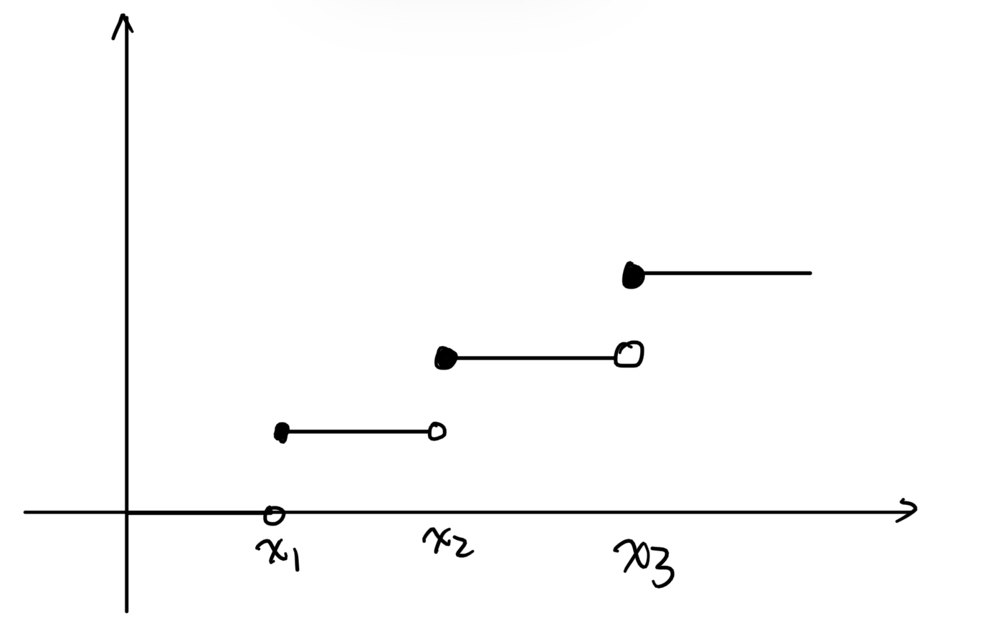

## Table of Contents
2. [Univariate Random Variables](#2-univariate-random-variables)

    2.1 [Introduction to probability model](#21-introduction-to-probability-model)
    2.2 [Discrete random variable](#22-discrete-random-variable)

## 2. Univariate Random Variables
### 2.1 Introduction to probability model
- <b>Probability model</b> is used to describe a random exprienment.
It consists of three important components:
    1. <b>Sample space</b> $S$: a collection of all possible outcomes of one random experiment.
        >e.g. Toss a coin: $S = \{H, T\}$

        >e.g. Toss a coin twice: $S = \{(H,H), (H,T), (T,H), (T,T)\}$
    2. <b>Event</b>: denoted by $A, B, C$, etc. It is a subset pf sample space.
        >e.g. Toss a coin twice:
        Define A as 1st toss is tail, $A = \{(T,T), (T,H)\} \subseteq S$
    3. <b>Probability function</b> $P$: It is a function of events. 
    It satisfies properties (axioms):
        1. $0 \leq P(A) \leq 1$ for any event $A$.
        2. $P(S) = 1$
        3. Countable additivity: If $A_1, A_2, \dots$ are assumed to be pairwise multually exclusive events (i.e. $A_i \cap A_j = \emptyset$ for $i \neq j$), $\displaystyle P\left(\bigcup_{i=1}^{\infty} A_i\right) = \sum_{i=1}^{\infty} P(A_i)$.

        We can now prove the following properties:
        1. $P(\emptyset) = 0$.
            >Proof: Let $A_i = \emptyset$ for $i \geq 1$, $A_i \cap A_j = \emptyset$ for $i \neq j$, by axioms we have $\displaystyle P\left(\bigcup_{i=1}^{\infty} A_i\right) = \sum_{i=1}^{\infty} P(A_i)$, or in other words, $\displaystyle P(\emptyset)=\sum_{i=1}^{\infty}P(\emptyset)$. Additionally, $0 \leq P(\emptyset) \leq 1$, therefore, $P(\emptyset) = 0$.
        2. Let A denote an event. Let $\bar{A}$ denote the complementary event of A, which means $\bar{A}$ saitifies two conditions:
            1) $\bar{A} \cap A = \emptyset$, and
            2) $\bar{A} \cup A = S$.

            Prove $P(A) + P(\bar{A}) = 1$:
            >Proof: Define $A_1 = A$, $A_2 = \bar{A}$, $A_i = \emptyset$ for $i \geq 3$, so $A_i \cap A_j = \emptyset$ for $i \neq j$, by axioms we have $\displaystyle P\left(\bigcup_{i=1}^{\infty} A_i\right) = \sum_{i=1}^{\infty} P(A_i)$, in other words, $\displaystyle P(S) = P(A) + P(\bar{A}) + \sum_{i=3}^{\infty}0$, therefore, $P(A) + P(\bar{A}) = 1$.
        3. If $A_1$ and $A_2$ are mutually exclusive, then $P(A_1 \cup A_2) = P(A_1) + P(A_2)$.
            >Proof: Define $A_i = \emptyset$ for $i \geq 3$, so $S = A_i \cap A_j = \emptyset$, for $i \neq j$. Then $\displaystyle P\left(\bigcup_{i=1}^{\infty} A_i\right) = \sum_{i=1}^{\infty} P(A_i)$, or in other words, $P(A_1 \cup A_2) = P(A_1) + P(A_2) + 0$.
        4. In general, $P(A_1 \cup A_2) = P(A_1) + P(A_2) - P(A_1 \cap A_2)$.
            >
            Proof: Define $B=\{\omega|\omega \in A_1, \omega \notin A_2\}$, since $A_1 = B\cup (A_1\cap A_2)$, we can get $B\cap (A_1 \cap A_2) = \emptyset$, $B\cup (A_1 \cap A_2) = A_1$, $B\cap (A_1 \cap A_2) = \emptyset$, $B\cap A_2 = \emptyset$, and therefore  $B\cup A_2 = A_1 \cup A_2$.
            Then $P(A_1 \cup A_2) = P(B \cup A_2) = P(B) + P(A_2)$. Note $P(A_1 \cup A_2) = P(A_2) + P(B)$ and $P(B) = P(A_1) - P(A_1 \cap A_2)$. Hence, $P(A_1 \cup A_2) = P(A_1) + P(A_2) - P(A_1 \cap A_2)$.
        5. If $A_1 \subseteq A_2$, then $P(A_1) \leq P(A_2)$
            >
            Proof: $A_2 \setminus A_1 := B  = \{\omega | \omega \in A_2, \omega \notin A_1\}$, we have $B\cap A_1 = \emptyset$, $B \cup A_1 = A_2$. Then $P(A_2) = P(A_1 \cup B) = P(A_1) + P(B) \geq P(A_1)$.
        
        
        >e.g. Toss a coin twice
        Then $S = \{(H,H), (H,T), (T,H), (T,T)\}$ for any event A,
        $$P(A):= \frac{\text{\# of elements in }A}{4}$$
        Verify P is a probability function.

- <b>Conditional probability</b>
    Suppose $A$ and $B$ denote two events. Provided $P(B) > 0$, then the conditional probability of A given B is
    $$P(A|B) = \frac{P(A \cap B)}{P(B)}$$
    - <b>Independence of two events</b>
        Suppose A and B denotes two events. We say A and B are independent if and only if
        $$P(A \cap B) = P(A)P(B)$$
        - Proposition: If A and B are independent, then $P(A|B) = P(A)$ (We assume $P(B) > 0$)
            >Proof: $P(A|B) = \frac{P(A \cap B)}{P(B)} = \frac{P(A)P(B)}{P(B)} = P(A)$
        >e.g. Toss a coin twice
            $A:= 1\text{st toss is a head} = \{(H,T), (H,H)\}\\B:= 2\text{nd toss is a head} = \{(T,H), (H,H)\}$
            For any event $C$, $P(C) = \frac{\text{\# of elements in }C}{4}$
            Verify A and B are independent.
            $P(A \cap B) = P(A)P(B)$?
            By definition, $A\cap B = \{(H,H)\} \implies P(A \cap B) = \frac{1}{4}$
            $P(A) = \frac{2}{4}$, $P(B) = \frac{2}{4}$.
            Hence, $P(A \cap B) = P(A)P(B)$.
- <b>Random variable (r.v.)</b> $X,Y, \zeta, \eta$
Random variable is a function from sample space to real line.
$$X: S \to \mathbb{R}$$
Specifically, given any $\omega \in S$, $X(\omega) \in \mathbb{R}$.
This function satisfies that for any $x\in \mathbb{R}$, $\{X\leq x\}=\{\omega|X(\omega) \leq x\}$ is an event.
    >e.g. Toss a coin twice
    $X:\text{\# of heads in two tosses}$.
    $X: (H,H) \mapsto 2$.
    We need to check for any $x$, $\{X\leq x\}$ is an event.
        1. $x \geq 2$, $\{X\leq x\}=\{\omega|X(\omega) \leq x\} = S$
        2. $x \in [1,2)$, what is $\{X\leq x\}$?
        3. $x \in [0,1)$, what is $\{X\leq x\}$?
        4. $x < 0$, what is $\{X\leq x\}$?

- <b>Cumulative distribution of X (c.d.f.)</b>
    For any $x \in \mathbb{R}$, the c.d.f. of $X$ is defined as $F(x) = P(X \leq x)$.
    It satisfies the following property:
    1. $F(x)$ is a non-decreasing fucntion, i.e., if $x_1 \leq x_2$, then $F(x_1) \leq F(x_2)$.
        >Proof: $\{X \leq x_1\}$ is an event. $\{X \leq x_1\} \subseteq \{X \leq x_2\}$ if $x_1 < x_2$, since $\{\omega|X(\omega) \leq x_1\} \leq \{\omega|X(\omega) \leq x_2\}$.
    2. $\displaystyle \lim_{x \to -\infty} F(x) = 0$, $\displaystyle \lim_{x \to \infty} F(x) = 1$.
    3. $F(x)$ is a right-continuous function, i.e., for any $a\in \mathbb{R}$, $\displaystyle \lim_{x \to a^+} F(x) = F(a)$. 
     

    1, 2 and 3 are three basic properties of a c.d.f.
    Some extra properties of a c.d.f.:

    4. $P(a < X \leq b) = F(b) - F(a)$.
        >Proof: Define $A=\{X\leq b\}, B:=\{X\leq a\}, C=\{a<x\leq b\}$, we want to prove: $P(a<X\leq b) = P(X\leq b) = P(X\leq a) \iff P(C)=P(A)-P(B)$. Note $B\cap C = \emptyset$, $B\cup C = A$. Then $P(A) = P(B\cup C) = P(B) + P(C)$.
    5. $P(X = a) = P(X\leq a) - P(x<a)=F(a)-F(a^-)$.
        > Proof: $P(X=a) = P(X\leq a) - P(X<a) = F(a) - \displaystyle \lim_{x \to a^-} F(x) = \lim_{x \to a^+}F(x)- \lim_{x \to a^-}F(x)$.
        

### 2.2 Discrete random variable
>Definition:
> If a random variable $X$ can only take on a finite or countably infinite number of values, then $X$ is called a discrete random variable.
- <b>cdf</b> of a discrete r.v. is a right continuous step funciton
    
- <b>Probability function (pf):</b> $f(x) = P(X=x)$.
    For a discrete r.v., $f(x)\begin{cases}>0, \text{if }X \text{ can take value }x\\=0, \text{if } X \text{ cannot take value } x\end{cases}$
- <b>Support</b>: The set $A = \{x: f(x) > 0\}$ is called the support of $X$. These are all the possible values that $X$ can take.
- Properties of a p.f. $f$ for a discrete r.v. $X$.
    1. $f(x) \geq 0$ for any $x \in \mathbb{R}$.
    2. $\displaystyle \sum_{x\in A} f(x) = 1$.
        > Proof: The support of X is a countable set, $A = \{x_1, \dots, x_n\}$. Let $B_i=\{X=x_i\}$ is an event for $i=1,...,n$. $B_i$ are pairwise mutually exclusive events, i.e. $B_i \cap B_j = \emptyset$ for $i \neq j$. Then, $\displaystyle \bigcup_{i=1}^n B_i = S$. Then, $\displaystyle1=P(S)=P\left( \bigcup_{i=1}^n B_i\right)=\sum_{i=1}^n P(B_i) = \sum_{i=1}^n P(X=x_i)$.
- Some commonly used discrete r.v.
    1. Bernoulli r.v. $X \sim \text{Bern}(p)$.
        X can only take two possible values, 0 and 1. $A = \{0,1\}$.
        $f(1) = P(X=1) = p$.
    2. Binomial distribution
        Toss a coin $n$ times.
        a. different tosses are indepedent
        b. probability of getting a head is fixed, which is denoted by $p$.
        $X$: # of heads across $n$ tosses, then $X \sim \text{Bin}(n,p)$.
        Hence the support of $X$, $A = \{0,1,2,\dots, n\}$.
        The p.f. of $X$ is $f(x) = P(X=x) = \displaystyle \binom{n}{x}p^x(1-p)^{n-x}$, $x\in A$.
        $\displaystyle \sum_{x=0}^{n} \binom{n}{x}p^x(1-p)^{n-x}=[p+(1-p)]^n=1$
    3. Geometric distribution
        $X$: # of failures before the first success.
        The support of $X$ is $A=\{0,1,...\}$.
        $f(x) = P(X=x) = (1-p)^xp$, $x\in A$.
        $\displaystyle \sum_{x=0}^{\infty} (1-p)^xp = \frac{p}{1-(1-p)} = 1$
    4. Negative binomial r.v. $X \sim \text{NegBin}(r, p)$
        $X$: # of failures before the $r$th success.
    5. Poisson r.v. $X \sim \text{Poisson}(\mu)$
        The support of $X$, $A = \{0,1,\dots\}$.
        The probability function $f(x) = P(X=x) = \frac{\mu^x}{x!}e^{-\mu}$, $x\in A$.
        $\displaystyle \sum_{x\in A} f(x) = \sum_{x=0}^{\infty} \frac{\mu^x}{x!}e^{-\mu} = e^{-\mu}\sum_{x=0}^{\infty} \frac{\mu^x}{x!} = e^{-\mu}e^{\mu} = 1$.
        Aside: $\displaystyle e^x = \sum_{k=0}^{\infty} \frac{x^k}{k!}$.

### 2.3 Continuous random variable
> Definition: If thr collection of all possible values $X$ can take is an interval or the real line, then X is called a continuous r.v.

> Remark: If $X$ is continuous r.v., its cdf $F(x)$ is continuous everywhere. Moreover, $F$ is differentialbe almost everywhere. It is not differentiable at atmost countable locations.
